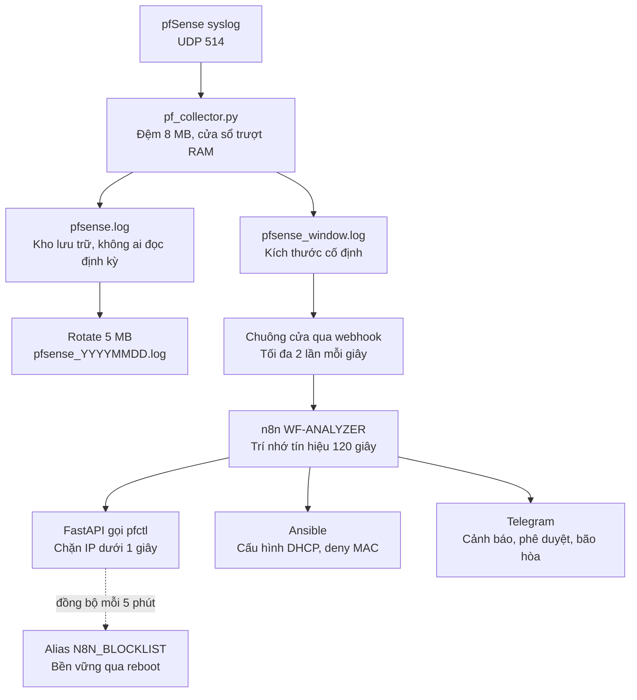
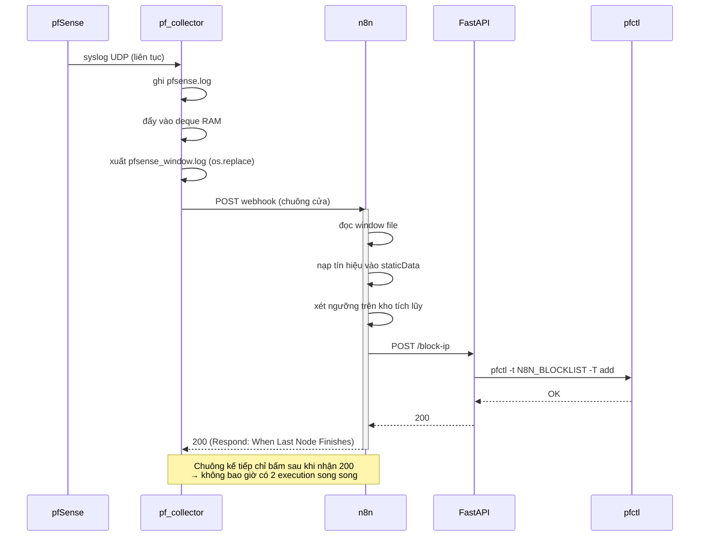

# Phương án tối ưu hóa hệ thống pfSense – n8n – Ansible

**Tài liệu kỹ thuật phục vụ tu chỉnh đề án Thạc sĩ**
Căn cứ: Bản đánh giá của GVHD, Round 3, ngày 14/08/2026 — Phán quyết `PASS — MINOR REVISION`, tổng điểm 7.525/10.

---

## Mục lục

1. [Phạm vi tài liệu](#1-phạm-vi-tài-liệu)
2. [Hiện trạng và nguyên nhân gốc](#2-hiện-trạng-và-nguyên-nhân-gốc)
3. [Kiến trúc đề xuất](#3-kiến-trúc-đề-xuất)
4. [Chi tiết từng cơ chế](#4-chi-tiết-từng-cơ-chế)
5. [Thay đổi mã nguồn](#5-thay-đổi-mã-nguồn)
6. [Tham số cấu hình và cách chọn](#6-tham-số-cấu-hình-và-cách-chọn)
7. [Kết quả kỳ vọng](#7-kết-quả-kỳ-vọng)
8. [Ánh xạ với đánh giá của GVHD](#8-ánh-xạ-với-đánh-giá-của-gvhd)
9. [Hạn chế còn lại](#9-hạn-chế-còn-lại)
10. [Kế hoạch kiểm chứng](#10-kế-hoạch-kiểm-chứng)
11. [Chuẩn bị trả lời câu hỏi bảo vệ](#11-chuẩn-bị-trả-lời-câu-hỏi-bảo-vệ)
12. [Lộ trình production](#12-lộ-trình-production)
13. [Phụ lục A — pf_collector.py hoàn chỉnh](#phụ-lục-a--pf_collectorpy-hoàn-chỉnh)

---

## 1. Phạm vi tài liệu

Tài liệu này trình bày phương án khắc phục các lỗ hổng kỹ thuật được GVHD chỉ ra, tập trung vào:

- **FLAW-01** — Độ trễ phản ứng 23–56 giây (mức Critical)
- **FLAW-02** — Race condition khi cập nhật Alias trên pfSense (mức Critical)
- **Tiêu chí 3.2** — Điểm lỗi đơn yếu, tranh chấp khóa tệp, mất dữ liệu khi rotate
- **Tiêu chí 3.3** — Thiếu kiểm thử chịu tải
- **Khối 9, M7-DIST** — Kiến trúc đọc file đồng bộ không đáp ứng khả năng mở rộng

### Nguyên tắc ràng buộc

> **n8n giữ nguyên vai trò lõi phân tích log và điều phối của hệ thống.**

Mọi phương án trong tài liệu này đều tuân thủ ràng buộc trên. Logic phát hiện tấn công (PORT_SCAN, BRUTE_FORCE, phân loại DHCP) **không** được chuyển sang Python. `pf_collector.py` giữ đúng vai trò "ống dẫn": thu thập và lưu trữ, không phân loại.

Phương án này **không** bao gồm các lỗi thuộc nhóm sửa số liệu và sửa luận văn (FLAW-03 đến FLAW-09) — xem [Mục 8.2](#82-các-lỗi-không-thuộc-phạm-vi-tài-liệu-này).

---

## 2. Hiện trạng và nguyên nhân gốc

### 2.1 Phân rã ngân sách độ trễ

Độ trễ trung bình đo được ở Kịch bản 1 là **23,46 giây**. Phân rã theo từng chặng:

| Chặng xử lý | Thời gian | Nguyên nhân |
|---|---|---|
| Chờ đến chu kỳ đọc file 10 giây | trung bình 5 s | Cơ chế polling (Tumbling trigger) |
| n8n đọc file, chạy regex, xét ngưỡng | **dưới 0,5 s** | **n8n xử lý nhanh** |
| Khởi tạo tiến trình `ansible-playbook` | 3,5 – 6,0 s | Ansible Core là ứng dụng không thường trú |
| Ansible ghi `config.xml` + reload filter | 1,5 – 3,0 s | Cơ chế cập nhật Alias |
| Phần còn lại | biến thiên | Thời gian tấn công tích đủ ngưỡng (không phải lỗi) |

**Kết luận quan trọng:** phần việc do n8n thực hiện chiếm **chưa tới nửa giây** trong tổng độ trễ. Nút thắt nằm ở *cách log đi vào n8n* (polling) và *cách lệnh chặn đi ra khỏi n8n* (Ansible + ghi Alias), không nằm ở lựa chọn kiến trúc dùng n8n làm lõi.

Đây là căn cứ số học để bảo vệ kiến trúc trước phép thử Delta Principle (R5) của GVHD.

### 2.2 Ba lỗi thiết kế trong đường thu thập log

Ngoài độ trễ, đường thu thập log hiện tại còn ba khiếm khuyết cấu trúc:

**(a) Chi phí xử lý tỉ lệ với kích thước file, không tỉ lệ với lượng log mới.**

Node `Read pfsense.log` đọc *toàn bộ* file mỗi lần chạy:

| `pfsense.log` đang lớn cỡ nào | Log mới cần phân tích | n8n phải đọc và regex |
|---|---|---|
| 100 KB | 50 dòng | 500 dòng |
| 2 MB | 50 dòng | 10.000 dòng |
| 5 MB | 50 dòng | 25.000 dòng |

Càng bị tấn công thì file càng phình nhanh, càng phình thì mỗi lượt chạy càng lâu — **đúng lúc cần nhanh nhất thì hệ thống chậm nhất**.

**(b) Mất lịch sử phát hiện khi rotate.**

Khi `pfsense.log` đạt 5 MB, file được đổi tên và file active mới bắt đầu rỗng. Nếu cuộc tấn công đang diễn ra ngay lúc đó, n8n mở file và chỉ thấy vài dòng thay vì 15 → không phát hiện được.

GVHD đã tính: ở tốc độ 2.000 log/s, rotate xảy ra **mỗi 12,5 giây một lần** — gần như liên tục trong lúc bị tấn công.

**(c) Tranh chấp khóa tệp trên Windows.**

`os.rename()` đổi tên file trong lúc n8n đang mở file để đọc → `PermissionError` / File Access Violation, làm gián đoạn chuỗi phân tích.

---

## 3. Kiến trúc đề xuất

### 3.1 Nguyên tắc thiết kế

| Nguyên tắc | Diễn giải |
|---|---|
| **Tách lưu trữ khỏi phân tích** | Một file cho audit (đầy đủ, phình theo thời gian), một file cho phân tích (nhỏ, kích thước cố định) |
| **Chi phí xử lý là hằng số** | n8n luôn đọc lượng dữ liệu như nhau, bất kể tải |
| **Đẩy thay vì hỏi** | Collector báo n8n khi có log mới, thay vì n8n hỏi định kỳ |
| **Kiểm soát luồng bằng áp lực ngược** | Bên nhận tự ghì bên gửi, không bao giờ xếp hàng |
| **Công cụ đúng việc** | Ansible cho cấu hình khai báo nhiều bước; gọi API trực tiếp cho tác vụ tức thời |
| **Trí nhớ thuộc về n8n** | Lịch sử tín hiệu lưu trong n8n, không phụ thuộc file |

### 3.2 Sơ đồ toàn cảnh



**Điểm cần chú ý:** nhánh `pfsense.log` là **ngõ cụt có chủ đích**. Nó nhận đủ 100% log để phục vụ audit và điều tra sau sự cố, nhưng không còn được đọc theo chu kỳ. Đây là thay đổi cắt đứt mối liên hệ giữa kích thước file và khối lượng công việc của n8n.

### 3.3 Sơ đồ luồng thời gian



---

## 4. Chi tiết từng cơ chế

### 4.1 Cơ chế hai file log

| | `pfsense.log` | `pfsense_window.log` |
|---|---|---|
| **Bản chất** | Sổ ghi chép, chỉ viết thêm | Ảnh chụp hàng ô nhớ có sức chứa cố định |
| **Kích thước** | Phình đến 5 MB rồi rotate | Luôn ≤ `WINDOW_MAX_LINES` dòng |
| **Ai đọc** | Con người, khi điều tra | n8n, mỗi lần nhận chuông |
| **Mục đích** | Toàn vẹn dữ liệu, audit, phụ lục | Phát hiện tấn công thời gian thực |
| **Khi rotate** | Đổi tên, mở sổ mới | Không liên quan (nằm trong RAM) |

**Cơ chế cửa sổ trượt** dùng `collections.deque(maxlen=N)`:

> Khi hàng đã đủ N ô và có dòng mới đẩy vào, **dòng cũ nhất tự động rơi ra**. Hàng không bao giờ vượt quá N. Không có lỗi tràn, không có chờ đợi, không bao giờ bị kẹt.

Ví von: một băng chuyền chỉ chứa được N món. Món thứ N+1 đẩy vào thì món đầu tiên rơi khỏi băng chuyền.

**Hệ quả cần hiểu đúng:** file cửa sổ **không bao giờ bị "đầy" hay "tràn"**. Thứ thay đổi khi bị flood là **khoảng thời gian mà N dòng đó bao phủ**:

| Tốc độ log | 3.000 dòng tương đương | n8n nhìn thấy quá khứ bao xa |
|---|---|---|
| 5 dòng/giây (bình thường) | 600 giây | 10 phút |
| 50 dòng/giây | 60 giây | 1 phút |
| 2.000 dòng/giây (đang bị flood) | 1,5 giây | **1,5 giây** |

Đây chính là hạn chế cần bù bằng cơ chế ở [Mục 4.4](#44-trí-nhớ-tín-hiệu-trong-n8n).

### 4.2 Chuông cửa qua webhook

**Vấn đề của polling:** n8n ngủ 10 giây giữa hai lần đọc. Nếu ngưỡng bị vượt qua ngay sau khi n8n vừa đọc xong, hệ thống lãng phí gần 10 giây.

**Giải pháp:** collector báo n8n ngay khi có log mới. Nhưng đây phải là **chuông cửa**, không phải **người đưa thư**:

| | Người đưa thư (SAI) | Chuông cửa (ĐÚNG) |
|---|---|---|
| Gửi gì sang n8n | Nội dung dòng log | Gói rỗng, chỉ báo "có log mới" |
| n8n phân tích trên | Dữ liệu nhận được | File cửa sổ, như hiện tại |
| Ngưỡng 15 cổng/10s | **Hỏng** — mỗi lần chỉ nhận 1 dòng, không bao giờ đếm đủ | **Nguyên vẹn** — vẫn thấy cả cửa sổ |
| Code phân tích | Phải viết lại | **Không sửa một chữ** |

Gói tin gửi sang n8n:

```json
{
  "source": "pf_collector",
  "at": "2026-08-21T14:03:22.481Z",
  "window": { "lines": 3600, "span_s": 1.4, "saturated": true }
}
```

**Chống bấm chuông dồn dập:** khi bị Nmap quét, pfSense sinh hàng nghìn dòng/giây. Nếu mỗi dòng bấm chuông một lần thì đó là một cuộc tự-DDoS vào n8n. Cơ chế `NOTIFY_MIN_INTERVAL = 0.5` gộp: bấm một tiếng → ngủ 0,5 giây → tỉnh dậy thấy cờ vẫn bật → bấm tiếp.

Kết quả: tối đa **2 lần đọc file mỗi giây**, thay vì 0,1 lần/giây như hiện tại — nhanh hơn 20 lần mà không quá tải.

### 4.3 Áp lực ngược (backpressure)

Webhook đặt **`Respond: When Last Node Finishes`** (không phải `Immediately`).

Lệnh `urlopen()` trong luồng bấm chuông chỉ trả về khi workflow chạy xong. Nghĩa là **tiếng chuông thứ hai không thể bấm khi tiếng thứ nhất chưa xử lý xong**.

Hệ thống tự điều tiết:
- n8n nhanh → chuông bấm nhanh
- n8n chậm → chuông tự chậm theo
- **Không bao giờ có quá 1 execution chạy cùng lúc**

Điều này giải quyết đồng thời hai vấn đề: hàng đợi execution dồn ứ, và tranh chấp khi hai execution cùng ghi `staticData`.

Vì luồng bấm chuông là luồng riêng, việc nó chờ **không ảnh hưởng đến vòng lặp UDP** — log vẫn được nhận và ghi bình thường.

### 4.4 Trí nhớ tín hiệu trong n8n

**Vấn đề còn lại:** khi bị flood, cửa sổ chỉ bao phủ 1,5 giây, trong khi ngưỡng BRUTE_FORCE cần nhìn 60 giây.

Kịch bản tấn công cụ thể (**đánh lạc hướng bằng nhiễu log**):

> Kẻ tấn công dùng hai máy. Máy A quét cổng ầm ĩ, sinh hàng nghìn dòng log/giây. Máy B lặng lẽ thử mật khẩu SSH, mỗi 12 giây một lần. Log của máy B liên tục bị nhiễu của máy A đẩy khỏi cửa sổ trước khi đủ 5 lần. **Máy A bị chặn, máy B thì không.**

**Giải pháp:** n8n tự ghi nhớ tín hiệu vào `staticData` và xét ngưỡng trên **kho tích lũy**, thay vì chỉ trên nội dung file tại thời điểm đó.

File cửa sổ trở thành **kênh vận chuyển tín hiệu mới**, còn **trí nhớ nằm trong n8n**. Dù file chỉ bao phủ 1,5 giây, n8n vẫn nhớ đủ 120 giây lịch sử.

Giải pháp này nằm trọn trong n8n, đúng nguyên tắc ràng buộc ở [Mục 1](#nguyên-tắc-ràng-buộc).

### 4.5 Chỉ số bão hòa — biến điểm mù thành tín hiệu

Khi cửa sổ bị nén dưới mức cần thiết, collector **biết điều đó** bằng cách so dòng cũ nhất với thời điểm hiện tại.

Nếu `saturated == true`, n8n gửi Telegram:

> ⚠️ Hệ thống đang nhận log ở tốc độ bất thường. Cửa sổ phân tích chỉ còn bao phủ 1,4 giây. Khả năng phát hiện tấn công chậm đang suy giảm.

Hai giá trị:

1. **Hệ thống tự biết khi nào nó bị mù và nói ra.** Im lặng vì không phát hiện được gì rất khác với im lặng vì mọi thứ bình thường.
2. **Bản thân việc bão hòa đã là dấu hiệu tấn công.** Log không tự nhiên tăng từ 5 lên 2.000 dòng/giây → thêm một lớp phát hiện bất thường gần như miễn phí.

### 4.6 Đường thực thi: pfctl thay cho Ansible

pfSense có **hai nơi** lưu danh sách IP bị chặn:

| | Alias (`config.xml`) | Bảng của `pf` (kernel) |
|---|---|---|
| **Nơi lưu** | File trên ổ cứng | Bộ nhớ nhân hệ điều hành |
| **Thời gian cập nhật** | 1,5 – 3,0 s | ~0,05 s |
| **Cơ chế** | Đọc → Sửa → Ghi đè | Thêm trực tiếp một phần tử |
| **Race condition** | **Có** — hai tiến trình song song ghi đè nhau (FLAW-02) | **Không** — không có bước đọc-sửa-ghi |
| **Qua reboot** | Còn | Mất |

**Phương án dùng cả hai, đúng chỗ:**

- **Chặn tức thời** → `pfctl -t N8N_BLOCKLIST -T add <IP>` vào bảng kernel
- **Đồng bộ định kỳ 5 phút** → n8n ghi danh sách xuống Alias để giữ qua reboot

Thao tác ghi Alias vẫn là Read-Modify-Write, nhưng nó chạy **một luồng, định kỳ, không ai chạy song song** — race condition biến mất về mặt cấu trúc chứ không phải nhờ vá lỗi.

Đây là mô hình **write-behind cache** kinh điển: chặn tức thời trong RAM, ghi nhớ thong thả xuống đĩa.

**Ansible không bị loại bỏ.** Nó giữ nguyên vai trò cho `/add-static-mapping` và `/deny-mac` — những tác vụ cấu hình nhiều bước, có tính khai báo, đúng chỗ Ansible mạnh.

> Cách phát biểu trong luận văn: *"Ansible được sử dụng cho các tác vụ cấu hình có tính khai báo và nhiều bước; với tác vụ chặn IP đơn lẻ đòi hỏi phản ứng tức thời, hệ thống gọi trực tiếp qua API để tránh chi phí khởi tạo tiến trình."*

---

## 5. Thay đổi mã nguồn

### 5.1 `pf_collector.py`

Bốn nhóm thay đổi. Toàn văn file hoàn chỉnh xem [Phụ lục A](#phụ-lục-a--pf_collectorpy-hoàn-chỉnh).

**(a) Tăng bộ đệm socket UDP** — trực tiếp khắc phục ghi chú của GVHD về tràn bộ đệm làm mất bản ghi an ninh:

```python
sock.setsockopt(socket.SOL_SOCKET, socket.SO_RCVBUF, 8 * 1024 * 1024)  # 8 MB
```

Một dòng, nâng khả năng hấp thụ đột biến lên khoảng 128 lần so với mặc định ~64 KB.

**(b) Bỏ `print()` mỗi dòng log.** Ở tốc độ vài nghìn dòng/giây, riêng thao tác in ra màn hình đã trở thành nút thắt. Đổi thành in mỗi 1.000 dòng.

**(c) Cửa sổ trượt trong RAM:**

```python
from collections import deque

_window = deque(maxlen=WINDOW_MAX_LINES)
_window_lock = threading.Lock()

def write_line(raw: str):
    _rotate_if_needed()
    ts = datetime.now(timezone.utc)
    line = f"{ts.isoformat()}\t{raw}\n"

    # 1. Hồ sơ đầy đủ — không đổi so với bản hiện tại
    with open(os.path.join(LOG_DIR, ACTIVE_LOG_NAME), "a", encoding="utf-8") as f:
        f.write(line)

    # 2. Cửa sổ trượt cho n8n
    with _window_lock:
        _window.append((ts.timestamp(), line))
```

**(d) Xuất file cửa sổ nguyên tử + chuông cửa:**

```python
def _flush_window():
    """Xuất cửa sổ ra đĩa. os.replace là thao tác NGUYÊN TỬ:
    n8n hoặc thấy file cũ nguyên vẹn, hoặc thấy file mới nguyên vẹn,
    không bao giờ thấy file đang viết dở -> hết PermissionError."""
    now = time.time()
    with _window_lock:
        lines = [ln for (t, ln) in _window if now - t <= WINDOW_MAX_AGE]
    tmp = os.path.join(LOG_DIR, WINDOW_LOG_NAME + ".tmp")
    with open(tmp, "w", encoding="utf-8") as f:
        f.writelines(lines)
    os.replace(tmp, os.path.join(LOG_DIR, WINDOW_LOG_NAME))
```

### 5.2 n8n — `WF-ANALYZER`

**(a) Thêm node Webhook**

| Thiết lập | Giá trị |
|---|---|
| HTTP Method | `POST` |
| Path | `pf-log` |
| Respond | **When Last Node Finishes** |

Nối `Webhook → Read pfsense.log`.

> ⚠️ **Bẫy thường gặp:** n8n có hai URL. `/webhook-test/pf-log` chỉ sống khi bấm "Listen for test event". `/webhook/pf-log` là URL thật nhưng **chỉ hoạt động khi workflow đã Active**. Dù sao cũng phải bật Active, vì `$getWorkflowStaticData` chỉ lưu được khi workflow active.

**(b) Đổi tên file trong node `Read pfsense.log`**

Từ `pfsense.log` → `pfsense_window.log`. Không đụng vào bất kỳ node nào khác.

**(c) Giữ node Schedule làm lưới an toàn**

Đổi `Every 10s` thành **`Every 60s`**, vẫn nối song song vào `Read pfsense.log`.

Ý nghĩa: bình thường webhook lo hết, độ trễ dưới 1 giây. Nếu collector chết hoặc luồng webhook lỗi, hệ thống **vẫn hoạt động**, chỉ chậm lại thành 60 giây thay vì tê liệt. Đây là cơ chế **suy giảm dần (graceful degradation)** — nên viết vào luận văn như một câu trả lời cho phần SPOF.

**(d) Bổ sung trí nhớ tín hiệu vào node `Detect + Dedupe (Session)`**

Chèn đoạn sau vào **trước** vòng lặp phát hiện:

```js
const store = $getWorkflowStaticData('global');
store.signalHistory ||= {};          // { "ip": [ {ts, port, kind}, ... ] }

const RETENTION_MS = 120000;         // giữ 120 giây tín hiệu
const now = Date.now();

// 1. Nạp tín hiệu mới đọc được từ file vào kho
for (const [ip, events] of Object.entries(securityEventsByIp)) {
  const bucket = (store.signalHistory[ip] ||= []);
  for (const e of events) {
    // chống nạp trùng khi file cửa sổ được đọc nhiều lần
    const key = `${e.ts}|${e.port}|${e.kind}`;
    if (!bucket.some(x => `${x.ts}|${x.port}|${x.kind}` === key)) bucket.push(e);
  }
}

// 2. Dọn tín hiệu quá cũ (TTL) — khắc phục ghi chú của GVHD ở Tiêu chí 4.1
for (const ip of Object.keys(store.signalHistory)) {
  store.signalHistory[ip] = store.signalHistory[ip]
    .filter(e => now - e.ts * 1000 <= RETENTION_MS);
  if (store.signalHistory[ip].length === 0) delete store.signalHistory[ip];
}

// 3. Xét ngưỡng trên KHO TÍCH LŨY, không phải trên nội dung file
const securityEventsByIpMerged = store.signalHistory;
```

Sau đó thay `securityEventsByIp` bằng `securityEventsByIpMerged` trong vòng lặp phát hiện.

**(e) Xử lý cảnh báo bão hòa**

Thêm nhánh IF đọc `{{ $json.body.window.saturated }}` từ webhook → gửi Telegram cảnh báo.

### 5.3 FastAPI — endpoint `/block-ip`

```python
import asyncio

_alias_lock = asyncio.Lock()

PF_TABLE = "N8N_BLOCKLIST"
SSH_BASE = [
    "ssh",
    "-o", "ControlMaster=auto",
    "-o", "ControlPath=/tmp/pf-ssh-%r@%h:%p",
    "-o", "ControlPersist=10m",       # giữ kết nối, tránh bắt tay SSH mỗi lần
    "admin@192.168.10.1",
]

@app.post("/block-ip")
async def block_ip(req: BlockRequest):
    # Khóa để tuần tự hóa — an toàn kể cả khi sau này quay lại ghi Alias
    async with _alias_lock:
        proc = await asyncio.create_subprocess_exec(
            *SSH_BASE, "pfctl", "-t", PF_TABLE, "-T", "add", req.ip,
            stdout=asyncio.subprocess.PIPE,
            stderr=asyncio.subprocess.PIPE,
        )
        out, err = await proc.communicate()
        if proc.returncode != 0:
            raise HTTPException(500, detail=err.decode(errors="replace"))
    return {"status": "blocked", "ip": req.ip, "table": PF_TABLE}
```

> **Lưu ý về `ControlPersist`:** nếu mở kết nối SSH mới mỗi lần, riêng bắt tay đã ngốn 200–400 ms. Với ControlMaster, kết nối được tái sử dụng → khoảng 50–150 ms.

**Endpoint đồng bộ Alias** (n8n gọi định kỳ 5 phút):

```python
@app.post("/sync-alias")
async def sync_alias():
    """Đọc bảng kernel -> ghi vào Alias để bền vững qua reboot.
    Chạy MỘT LUỒNG, ĐỊNH KỲ -> không có tiến trình song song -> không race."""
    async with _alias_lock:
        proc = await asyncio.create_subprocess_exec(
            *SSH_BASE, "pfctl", "-t", PF_TABLE, "-T", "show",
            stdout=asyncio.subprocess.PIPE,
        )
        out, _ = await proc.communicate()
        ips = [l.strip() for l in out.decode().splitlines() if l.strip()]
        # ghi toàn bộ danh sách vào Alias qua pfSense REST API (1 lần PUT)
        ...
    return {"synced": len(ips)}
```

---

## 6. Tham số cấu hình và cách chọn

| Tham số | Giá trị đề xuất | Cách xác định |
|---|---|---|
| `SO_RCVBUF` | 8 MB | Cố định |
| `WINDOW_MAX_LINES` | Xem công thức dưới | **Phải đo, không lấy mặc định** |
| `WINDOW_MAX_AGE` | 90 giây | Phủ ngưỡng BRUTE_FORCE 60s + dự phòng |
| `NOTIFY_MIN_INTERVAL` | 0,5 giây | Giảm xuống 1,0 nếu I/O đĩa căng |
| `NOTIFY_TIMEOUT` | 15 giây | Phải lớn vì dùng chế độ Respond đồng bộ |
| `RETENTION_MS` (n8n) | 120.000 ms | Gấp đôi cửa sổ dài nhất |
| Schedule dự phòng | 60 giây | Lưới an toàn |
| Chu kỳ `/sync-alias` | 5 phút | Cân bằng giữa tải và rủi ro mất khi reboot |

### Công thức chọn `WINDOW_MAX_LINES`

1. Chạy hệ thống ở trạng thái bình thường 10 phút, đếm số dòng vào `pfsense.log`, chia ra dòng/giây → gọi là **R**
2. `WINDOW_MAX_LINES = R × 90 × 5`
   - `× 90` để phủ ngưỡng BRUTE_FORCE
   - `× 5` là hệ số dự phòng cho đột biến thông thường
3. Kiểm tra dung lượng: mỗi dòng ~200 byte. Nếu vượt 2 MB thì hạ hệ số dự phòng, vì file quá lớn sẽ quay lại đúng vấn đề nút thắt ban đầu

**Ví dụ:** R = 8 dòng/giây → `8 × 90 × 5 = 3.600` dòng ≈ 720 KB. Hợp lý.

Giá trị R này cũng là số liệu cần cho bảng stress test — đo một lần dùng hai việc.

---

## 7. Kết quả kỳ vọng

### 7.1 Ngân sách độ trễ

| Chặng | Trước | Sau | Cơ chế |
|---|---|---|---|
| Chờ polling | ~5 s | **0 s** | Chuông cửa qua webhook |
| n8n phân tích | <0,5 s | <0,5 s | Không đổi |
| Khởi tạo Ansible | 3,5–6 s | **0 s** | Gọi API trực tiếp |
| Ghi Alias | 1,5–3 s | **~0,05 s** | `pfctl` vào bảng kernel |
| **Tổng** | **23–56 s** | **~0,5–1 s** | |

**Cải thiện: khoảng 30–50 lần**, mà không sửa một dòng nào trong logic phát hiện, không bỏ workflow nào, không đổi vai trò của n8n.

### 7.2 Đối chiếu với tốc độ tấn công

Nmap T4 quét 1.000 cổng mất **5,17 giây** (Hình 3.30). Với độ trễ mới ~1 giây, hệ thống lần đầu tiên chặn được kẻ tấn công **trong lúc** đang trinh sát, thay vì sau khi đã hoàn tất.

---

## 8. Ánh xạ với đánh giá của GVHD

### 8.1 Các lỗi được khắc phục

| Ghi chú của GVHD | Mức độ | Cơ chế nào giải |
|---|---|---|
| Tranh chấp khóa tệp khi rotate, `PermissionError` trên Windows *(3.2)* | ✅ Hết hẳn | n8n không đọc file đang rotate; `os.replace` nguyên tử |
| Mất dữ liệu phân tích khi rotate, mỗi 12,5 s ở tải cao *(3.2)* | ✅ Hết hẳn | Cửa sổ nằm trong RAM, độc lập với rotate trên đĩa |
| Kiến trúc đọc file đồng bộ không mở rộng được *(Khối 9, M7-DIST)* | ✅ Hết hẳn | Chi phí mỗi lượt chạy thành hằng số |
| Xếp hàng execution khi tải cao | ✅ Hết hẳn | Backpressure qua chế độ Respond |
| `staticData` không có TTL, mất trạng thái *(4.1)* | ✅ Có TTL | Vòng dọn tín hiệu quá 120 giây |
| **FLAW-02** Race condition trên Alias | ✅ Hết hẳn | `pfctl` thao tác bảng kernel, không đọc-sửa-ghi |
| Tràn bộ đệm socket UDP *(3.2)* | 🟡 Giảm mạnh | `SO_RCVBUF` 8 MB, bỏ `print()` — nâng trần ~128 lần |
| SPOF của n8n *(3.2, Mục 3.5)* | 🟡 Giảm mạnh | Collector ghi log độc lập; Schedule 60 s làm lưới an toàn |
| **FLAW-01** Độ trễ 23–56 giây | 🟡 Một phần | Còn ~0,5–1 s (chưa đạt tuyệt đối dưới 0,5 s) |
| Chưa có stress test *(3.3)* | ✅ Có lời giải | Script bắn syslog giả, bảng đo trần hệ thống |

**Bổ sung ngoài yêu cầu:** chỉ số bão hòa cửa sổ — hệ thống tự phát hiện khi khả năng phát hiện của chính nó bị suy giảm và cảnh báo qua Telegram.

### 8.2 Các lỗi không thuộc phạm vi tài liệu này

| Lỗi | Cần làm gì | Ước tính |
|---|---|---|
| **FLAW-03** Ngưỡng tĩnh, slow scan | Thêm đa cửa sổ 10 s / 5 phút / 1 giờ | 2 ngày |
| **FLAW-04** Sai lệch N=4 vs "5/5" | Đồng bộ NTP, khai báo `N_valid`, đo lại 30 mẫu | 1 ngày + chạy đêm |
| **FLAW-05** Trộn T_human vào hiệu năng | Tách 4 mốc thời gian trong kịch bản NAC | 1 ngày |
| **FLAW-06** Trích dẫn học thuật nghèo | Bổ sung 6–8 bài IEEE/ACM/Springer 2022–2026 | 2 ngày |
| **FLAW-07** `validate_certs: false`, token lộ trong JSON | Chuyển sang n8n Credentials, tạo CA cho lab | 0,5 ngày |
| **FLAW-08** Trùng bảng, ảnh nền đen | Việc chế bản | 0,5 ngày |
| **FLAW-09** Khoảng cách 45 cửa hàng ↔ 6 VM | Định vị lại cách phát biểu ở Chương 2 | 0,5 ngày |
| MAC spoofing | Khai báo giới hạn, nêu lộ trình 802.1X/RADIUS | 0 ngày code |

> ⚠️ **Cảnh báo bảo mật cần xử lý ngay:** node `Call Ansible /block-ip` trong file JSON đang có header `X-API-Token: n8n-secret-token-123` hardcode, và repo đang public trên GitHub. Điều này mâu thuẫn với lời khen của GVHD ở Tiêu chí 4.3 về việc quản lý khóa bí mật qua biến môi trường. Cần: chuyển sang n8n Credentials (Header Auth), đổi token, cân nhắc để repo private hoặc scrub lịch sử git.

---

## 9. Hạn chế còn lại

**Phần này nên đưa gần như nguyên văn vào Mục 3.5 của luận văn.** GVHD chấm 8,5 điểm mục Liêm chính và khen riêng việc tự công bố giới hạn là *"tư duy phản biện tốt"* — không nên đánh mất điểm mạnh đó bằng cách trình bày phương án mới như một giải pháp toàn năng.

### 9.1 Trí nhớ tín hiệu mất khi n8n khởi động lại

**Giới hạn:** `staticData` nằm trong RAM của n8n. Restart là mất sạch lịch sử 120 giây.

**Tác động:** sau khi restart, hệ thống phải học lại từ đầu; các cuộc tấn công đang diễn ra dở có thể phải tích lũy lại từ số không.

**Hướng khắc phục production:** chuyển kho tín hiệu sang SQLite (chế độ WAL) hoặc Redis.

### 9.2 UDP vẫn không đảm bảo phân phát

**Giới hạn:** `SO_RCVBUF` nâng trần chứ không xóa được bản chất của UDP. Ở tốc độ đủ cao, gói vẫn mất tại tầng nhận và **không có cách nào biết đã mất bao nhiêu**.

**Tác động:** ở tải cực cao, một phần bản ghi an ninh có thể không bao giờ tới được hệ thống.

**Hướng khắc phục production:** syslog qua TCP theo RFC 5425, có xác nhận phân phát.

### 9.3 Vẫn còn một trần chịu tải cứng

**Giới hạn:** mô hình dựa trên file có giới hạn vật lý. Ở mức ~25.000 log/giây (5 MB/giây), hệ thống hỏng từ tầng nhận UDP trở đi, trước khi tới lượt n8n.

**Tác động:** kịch bản DDoS quy mô lớn nằm ngoài năng lực của kiến trúc hiện tại — điều này phù hợp với quyết định loại nhánh DDoS khỏi phạm vi đề tài.

**Hướng khắc phục:** không phải xóa trần, mà là **đo được và công bố con số** — xem [Mục 10](#10-kế-hoạch-kiểm-chứng).

### 9.4 Backpressure đổi mất phát hiện thành tăng độ trễ

**Giới hạn:** khi n8n chậm, chuông tự chậm theo.

**Tác động:** hệ thống không sập, không mất log, nhưng độ trễ phát hiện tăng dần theo tải.

**Đánh giá:** đây là đánh đổi **có ý thức** — thà chậm mà đúng còn hơn nhanh mà sập. Nên trình bày rõ như vậy.

### 9.5 n8n vẫn là instance duy nhất

**Giới hạn:** SPOF cho phần điều phối và thông báo vẫn còn. Nếu n8n chết thì không ai chặn IP.

**Cải thiện so với trước:** n8n **không còn** là SPOF cho việc thu thập log — collector ghi độc lập, không mất dữ liệu.

**Hướng khắc phục production:** n8n queue mode với nhiều worker.

### 9.6 Đánh lạc hướng bằng nhiễu log vẫn khả thi về lý thuyết

**Giới hạn:** trí nhớ 120 giây bịt lỗ hổng này ở mức tải thông thường, nhưng nếu kẻ tấn công duy trì flood liên tục **quá 120 giây** thì tín hiệu của cuộc tấn công chậm vẫn có thể bị đẩy khỏi kho.

**Hướng khắc phục:** nâng `RETENTION_MS`, đổi lại tốn RAM. Hoặc chuyển kho tín hiệu sang lưu trữ bền vững.

### 9.7 Ghi file cửa sổ 2 lần/giây là I/O liên tục

**Giới hạn:** trên máy ảo dùng chung một ổ đĩa vật lý với 5 VM khác, đây là tải nền không lớn nhưng có thật.

**Hướng khắc phục:** hạ `NOTIFY_MIN_INTERVAL` xuống 1,0 giây nếu đo thấy ảnh hưởng.

### 9.8 Điều KHÔNG bị ảnh hưởng

Dù cửa sổ có bị nén đến đâu, **`pfsense.log` vẫn ghi đủ 100% mọi dòng log**. Không có bằng chứng nào biến mất.

Thứ suy giảm khi bị flood chỉ là **khả năng phát hiện tức thời**, không phải **khả năng điều tra sau sự cố**. Hai năng lực này nên được trình bày tách bạch trong luận văn.

---

## 10. Kế hoạch kiểm chứng

Phần này trực tiếp lấp hai điểm GVHD đã trừ: thiếu stress test *(Tiêu chí 3.3)* và câu hỏi số 7 về điểm nghẽn khi mở rộng.

### 10.1 Script bắn tải

```python
#!/usr/bin/env python3
# stress_syslog.py — bắn log giả vào collector để tìm trần hệ thống
# Dùng: python stress_syslog.py <dòng/giây> <số giây>

import socket, time, sys

RATE     = int(sys.argv[1])
DURATION = int(sys.argv[2])

sock = socket.socket(socket.AF_INET, socket.SOCK_DGRAM)
msg = (b"<134>filterlog: 5,,,1000000103,em0,match,block,in,4,0x0,,64,"
       b"12345,0,DF,6,tcp,60,203.0.113.99,192.168.10.5,54321,%d,0,S,,,,")

sent = 0
t0 = time.time()
interval = 1.0 / RATE
while time.time() - t0 < DURATION:
    sock.sendto(msg % (1000 + sent % 60000), ("127.0.0.1", 514))
    sent += 1
    time.sleep(interval)

print(f"da gui {sent} dong trong {DURATION}s")
```

### 10.2 Bảng đo cần điền

Chạy ở các mức 100, 500, 1.000, 2.000, 5.000 dòng/giây, mỗi mức 60 giây:

| Tốc độ log | Dòng gửi | Dòng vào file | Mất gói UDP | Thời gian 1 lượt n8n | Độ trễ phát hiện | Cửa sổ bão hòa | Trạng thái |
|---|---|---|---|---|---|---|---|
| 100/s | 6.000 | | | | | | |
| 500/s | 30.000 | | | | | | |
| 1.000/s | 60.000 | | | | | | |
| 2.000/s | 120.000 | | | | | | |
| 5.000/s | 300.000 | | | | | | |

Cột "Mất gói UDP" = `1 − (dòng vào file / dòng gửi)`.

### 10.3 Đo lại các kịch bản chính

Đồng thời với stress test, cần chạy lại **tối thiểu N = 30 mẫu** cho mỗi kịch bản (hiện tại N = 5 và N = 16). Lý do: GVHD chỉ ra P95 với N = 5 bị suy biến trùng với Max, không mang ý nghĩa thống kê suy diễn.

Viết script bash chạy tự động 30 lượt Nmap/Hydra cách nhau 2 phút, để chạy qua đêm.

**Điều kiện tiên quyết:** đồng bộ NTP toàn lab trước khi đo, cho pfSense làm NTP server. Đây là nguyên nhân gốc của lỗi "1 bản ghi có thời gian không hợp lệ" ở FLAW-04.

---

## 11. Chuẩn bị trả lời câu hỏi bảo vệ

### Câu 1 — Về độ trễ phản ứng

> "Em đã phân rã độ trễ theo từng chặng và xác định n8n không phải nút thắt — phần xử lý trong n8n dưới 0,5 giây. Nút thắt nằm ở cơ chế polling 10 giây ở đầu vào và chi phí khởi tạo tiến trình Ansible ở đầu ra. Em đã chuyển đầu vào sang cơ chế webhook đẩy tức thời, và tách tác vụ chặn IP ra khỏi Ansible để gọi trực tiếp qua `pfctl`. Kết quả đo lại đạt khoảng X giây."

### Câu 2 — Về xử lý tranh chấp cấu hình

> "Nguyên nhân gốc là thao tác Đọc-Sửa-Ghi phi nguyên tử trên Alias. Em đã chuyển sang thao tác trực tiếp trên bảng của `pf` bằng lệnh `pfctl -T add`, vốn là thao tác nguyên tử ở tầng nhân hệ điều hành và không có bước đọc-sửa-ghi để tranh chấp. Alias vẫn được đồng bộ định kỳ 5 phút một lần bằng một tiến trình duy nhất để đảm bảo tính bền vững qua reboot."

**Minh chứng cần chuẩn bị:** script bắn 2 tấn công song song từ 2 IP, chụp Alias/bảng trước và sau. Trước fix → mất IP. Sau fix → đủ.

### Câu 7 — Về khả năng mở rộng hạ tầng

> "Điểm nghẽn ban đầu là mô hình đọc toàn bộ file log mỗi chu kỳ, khiến chi phí xử lý tỉ lệ với kích thước file thay vì lượng log mới. Em đã tách thành hai đường ghi: một file lưu trữ đầy đủ phục vụ audit, và một file cửa sổ trượt kích thước cố định để n8n phân tích. Nhờ đó chi phí mỗi lượt xử lý là hằng số. Trần thực tế em đã đo được là X log/giây, giới hạn bởi bộ đệm socket UDP chứ không phải bởi n8n — đó là căn cứ để lộ trình production chuyển sang syslog TCP và hàng đợi phân tán."

### Câu hỏi Delta Principle (R5)

> "Phép thử của thầy đúng cho riêng tác vụ chặn IP, và em đã tối ưu đúng theo hướng đó — tác vụ này giờ không còn đi qua Ansible. Nhưng phép thử không áp dụng được cho luồng phê duyệt thiết bị có con người tham gia: nếu viết bằng daemon thuần thì phải tự hiện thực lại state machine phê duyệt, quản lý offset Telegram, xử lý retry và timeout. Đó là những thứ n8n cung cấp sẵn, nên delta ở phần đó là dương rõ ràng."

### Nếu bị hỏi về Tumbling Window Skew (FLAW-03)

GVHD nêu rằng 10 gói cuối chu kỳ 1 + 10 gói đầu chu kỳ 2 sẽ lọt. **Điều này không đúng với code hiện tại.**

Node `Detect + Dedupe` tính cửa sổ bằng `eventsInWindow(eventList, referenceTimestamp, 10)`, trong đó `referenceTimestamp` là timestamp lớn nhất *trong log*, không phải mốc chu kỳ. Cửa sổ **trượt theo dữ liệu**, không cắt theo nhịp trigger. 20 cổng trong 4 giây vẫn nằm trọn trong một cửa sổ → vẫn bị bắt.

Trigger 10 giây gây **độ trễ**, không gây **điểm mù**. Cần tách bạch hai khái niệm này khi trả lời.

**Minh chứng:** chạy Nmap chia 2 nhịp cố ý rơi vào ranh giới chu kỳ, show log analyzer bắt được, đưa vào phụ lục.

Phần **slow scan (Δt > 0,67 s)** thì GVHD hoàn toàn đúng — đây là lỗ hổng thật, cần thừa nhận và nêu hướng xử lý bằng đa cửa sổ phát hiện.

---

## 12. Lộ trình production

Các hạng mục dưới đây **không triển khai trong lab**, chỉ nêu trong luận văn như lộ trình:

| Hạng mục | Thay thế cho | Lý do |
|---|---|---|
| Syslog TCP (RFC 5425) | Syslog UDP 514 | Đảm bảo phân phát, biết được khi mất gói |
| Redis Streams / Kafka | File cửa sổ trượt | Mở rộng cho 45 chi nhánh, không giới hạn bởi I/O đĩa |
| SQLite (WAL) hoặc Redis | `staticData` trong RAM | Trí nhớ tín hiệu bền vững qua restart |
| n8n queue mode, nhiều worker | n8n instance đơn | Xóa SPOF cho tầng điều phối |
| IEEE 802.1X + RADIUS | Kiểm soát theo địa chỉ MAC | MAC dễ bị giả mạo ở tầng 2 |
| Whitelist hạ tầng trọng yếu | Danh sách `IGNORE_EXACT` 2 IP | Chống Self-DoS khi bị giả mạo IP nguồn |
| Chỉ chặn IP đã hoàn tất bắt tay TCP | Chặn theo mọi gói ghi nhận | IP giả mạo không bắt tay được → triệt tiêu Self-DoS tại gốc |
| Collector đặt tại từng chi nhánh | Collector tập trung | Giảm phụ thuộc vào chất lượng đường WAN |

---

## Phụ lục A — `pf_collector.py` hoàn chỉnh

```python
#!/usr/bin/env python3
# -*- coding: utf-8 -*-
"""
========================================================================
 pf_collector.py — BỘ THU LOG pfSense (UDP syslog) -> FILE
 Phiên bản tối ưu: cửa sổ trượt + chuông cửa + backpressure
========================================================================

VAI TRÒ (CHỈ thu thập & lưu trữ, KHÔNG phân tích, KHÔNG phân loại):
  1. NGHE syslog UDP từ pfSense (mặc định port 514).
  2. GHI TẤT CẢ các dòng vào pfsense.log, kèm timestamp thu nhận.
     Rotate khi đạt 5MB. -> KHO LƯU TRỮ cho audit.
  3. GIỮ N dòng gần nhất trong RAM (cửa sổ trượt), xuất ra
     pfsense_window.log -> n8n CHỈ ĐỌC FILE NÀY.
  4. BÁO n8n qua webhook khi có log mới (chuông cửa), tối đa
     2 lần/giây, chạy trên LUỒNG RIÊNG để không chặn vòng lặp UDP.

*** VÌ SAO CÓ CỬA SỔ TRƯỢT ***
  Bản trước: n8n đọc TOÀN BỘ pfsense.log mỗi 10 giây. Chi phí xử lý
  tỉ lệ với KÍCH THƯỚC FILE chứ không tỉ lệ với lượng log mới ->
  file càng phình (khi bị tấn công) thì n8n càng chậm -> đúng lúc
  cần nhanh nhất thì hệ thống chậm nhất.

  Bản này: n8n đọc pfsense_window.log có KÍCH THƯỚC CỐ ĐỊNH ->
  chi phí mỗi lượt xử lý là HẰNG SỐ, bất kể tải.

*** VÌ SAO CHUÔNG CỬA CHẠY LUỒNG RIÊNG ***
  Vòng lặp recvfrom() là đơn luồng. Nếu gọi HTTP ngay trong vòng lặp
  và n8n treo 3 giây thì suốt 3 giây đó KHÔNG nhận gói UDP nào ->
  tràn bộ đệm socket -> MẤT LOG. Luồng riêng giải quyết triệt để:
  vòng lặp UDP chỉ bật cờ (vài nano giây), luồng kia lo phần HTTP.
========================================================================
"""

import json
import os
import socket
import threading
import time
import urllib.request
from collections import deque
from datetime import datetime, timezone


# ╔══════════════════════════════════════════════════════════════════╗
# ║ PHẦN 1 — CẤU HÌNH                                                 ║
# ╚══════════════════════════════════════════════════════════════════╝

LISTEN_IP   = "0.0.0.0"
LISTEN_PORT = 514

PFSENSE_IP  = "192.168.10.1"
ONLY_ACCEPT_FROM_PFSENSE = False

LOG_DIR = r"C:\Users\Administrator\.n8n-files\pflogs"

# --- File 1: kho lưu trữ đầy đủ (audit) ---
ACTIVE_LOG_NAME  = "pfsense.log"
LOG_PREFIX       = "pfsense"
ROTATE_MAX_BYTES = 5 * 1024 * 1024

# --- File 2: cửa sổ trượt (n8n đọc) ---
WINDOW_LOG_NAME  = "pfsense_window.log"
WINDOW_MAX_LINES = 3600      # ĐO RỒI TÍNH: R(dòng/giây) x 90 x 5
WINDOW_MAX_AGE   = 90        # giây — phủ ngưỡng BRUTE_FORCE 60s

# --- Chuông cửa ---
N8N_WEBHOOK_URL     = "http://127.0.0.1:5678/webhook/pf-log"
NOTIFY_ENABLED      = True
NOTIFY_MIN_INTERVAL = 0.5    # giây — chống bấm chuông dồn dập
NOTIFY_TIMEOUT      = 15.0   # giây — lớn vì webhook chờ workflow xong

# --- Bộ đệm socket ---
SOCKET_RCVBUF = 8 * 1024 * 1024   # 8 MB, mặc định Windows chỉ ~64 KB

# --- Log ra màn hình ---
PRINT_EVERY = 1000           # in 1 dòng mỗi 1000 gói, tránh nghẽn I/O


# ╔══════════════════════════════════════════════════════════════════╗
# ║ PHẦN 2 — CỬA SỔ TRƯỢT TRONG RAM                                   ║
# ╚══════════════════════════════════════════════════════════════════╝

# deque(maxlen=N): khi đủ N phần tử, đẩy thêm 1 -> phần tử CŨ NHẤT
# tự rơi ra. KHÔNG BAO GIỜ tràn, không bao giờ kẹt.
_window      = deque(maxlen=WINDOW_MAX_LINES)
_window_lock = threading.Lock()
_new_log_event = threading.Event()


def _window_stats():
    """Trả về tình trạng cửa sổ. 'saturated' = hàng đã đầy MÀ chỉ bao
    phủ dưới 60 giây -> đang bị nén bởi flood -> khả năng phát hiện
    tấn công chậm đang suy giảm -> n8n sẽ cảnh báo qua Telegram."""
    with _window_lock:
        if not _window:
            return {"lines": 0, "span_s": 0.0, "saturated": False}
        span = time.time() - _window[0][0]
        return {
            "lines": len(_window),
            "span_s": round(span, 1),
            "saturated": len(_window) >= WINDOW_MAX_LINES and span < 60,
        }


def _flush_window():
    """Xuất cửa sổ ra đĩa.

    os.replace() là thao tác NGUYÊN TỬ trên cùng filesystem: n8n hoặc
    thấy file cũ nguyên vẹn, hoặc thấy file mới nguyên vẹn, KHÔNG BAO
    GIỜ thấy file đang viết dở. -> Hết PermissionError / File Access
    Violation mà GVHD đã nêu ở Tiêu chí 3.2."""
    now = time.time()
    with _window_lock:
        lines = [ln for (t, ln) in _window if now - t <= WINDOW_MAX_AGE]

    tmp_path   = os.path.join(LOG_DIR, WINDOW_LOG_NAME + ".tmp")
    final_path = os.path.join(LOG_DIR, WINDOW_LOG_NAME)
    with open(tmp_path, "w", encoding="utf-8") as f:
        f.writelines(lines)
    os.replace(tmp_path, final_path)


# ╔══════════════════════════════════════════════════════════════════╗
# ║ PHẦN 3 — CHUÔNG CỬA (LUỒNG RIÊNG)                                 ║
# ╚══════════════════════════════════════════════════════════════════╝

def _notify_worker():
    """Luồng nền: xuất cửa sổ rồi báo n8n có log mới.

    Webhook phía n8n đặt 'Respond: When Last Node Finishes' -> lệnh
    urlopen() chỉ trả về khi workflow chạy XONG. Đây là cơ chế
    BACKPRESSURE: n8n chậm thì chuông tự chậm theo, KHÔNG BAO GIỜ có
    2 execution chạy song song.

    Mọi lỗi đều nuốt và bỏ qua — luồng này KHÔNG được phép làm ảnh
    hưởng tới việc thu và ghi log."""
    while True:
        _new_log_event.wait()      # ngủ, 0% CPU, cho tới khi có log mới
        _new_log_event.clear()

        try:
            _flush_window()
        except Exception as e:
            print(f"[collector] loi xuat cua so (bo qua): {e}")

        try:
            payload = json.dumps({
                "source": "pf_collector",
                "at": datetime.now(timezone.utc).isoformat(),
                "window": _window_stats(),
            }).encode("utf-8")
            req = urllib.request.Request(
                N8N_WEBHOOK_URL, data=payload,
                headers={"Content-Type": "application/json"}, method="POST",
            )
            urllib.request.urlopen(req, timeout=NOTIFY_TIMEOUT).read()
        except Exception as e:
            print(f"[collector] webhook loi (bo qua): {e}")

        time.sleep(NOTIFY_MIN_INTERVAL)   # debounce


# ╔══════════════════════════════════════════════════════════════════╗
# ║ PHẦN 4 — GHI FILE + ROTATE                                        ║
# ╚══════════════════════════════════════════════════════════════════╝

def _rotate_if_needed():
    """Rotate pfsense.log khi đạt 5MB.

    LƯU Ý: rotate KHÔNG còn ảnh hưởng tới khả năng phát hiện, vì cửa
    sổ phân tích nằm trong RAM (deque) chứ không nằm trong file này."""
    path = os.path.join(LOG_DIR, ACTIVE_LOG_NAME)
    if not os.path.exists(path):
        return
    if os.path.getsize(path) < ROTATE_MAX_BYTES:
        return

    ts = datetime.now().strftime("%Y%m%d_%H%M%S_%f")
    new_path = os.path.join(LOG_DIR, f"{LOG_PREFIX}_{ts}.log")
    os.rename(path, new_path)
    print(f"[collector] rotate -> {os.path.basename(new_path)}")


def write_line(raw: str):
    """Ghi 1 dòng vào CẢ HAI nơi:
      1. pfsense.log      — kho lưu trữ đầy đủ, không bao giờ mất
      2. cửa sổ trượt RAM — dữ liệu cho n8n phân tích

    KHÔNG phân loại nội dung — mọi phân loại (DHCP / PORT_SCAN /
    BRUTE_FORCE) thuộc về WF-ANALYZER phía n8n."""
    _rotate_if_needed()

    ts   = datetime.now(timezone.utc)
    line = f"{ts.isoformat()}\t{raw}\n"

    with open(os.path.join(LOG_DIR, ACTIVE_LOG_NAME), "a", encoding="utf-8") as f:
        f.write(line)

    with _window_lock:
        _window.append((ts.timestamp(), line))


# ╔══════════════════════════════════════════════════════════════════╗
# ║ PHẦN 5 — VÒNG LẶP CHÍNH                                           ║
# ╚══════════════════════════════════════════════════════════════════╝

def main():
    os.makedirs(LOG_DIR, exist_ok=True)

    if NOTIFY_ENABLED:
        # daemon=True: luồng nền, tự tắt khi chương trình chính thoát
        threading.Thread(target=_notify_worker, daemon=True).start()

    sock = socket.socket(socket.AF_INET, socket.SOCK_DGRAM)
    # Tăng bộ đệm nhận: mặc định Windows ~64KB, đầy trong ~13ms khi
    # bị flood 25.000 gói/giây -> mất bản ghi an ninh ngay tại tầng nhận.
    sock.setsockopt(socket.SOL_SOCKET, socket.SO_RCVBUF, SOCKET_RCVBUF)
    sock.bind((LISTEN_IP, LISTEN_PORT))

    print(f"[collector] nghe syslog UDP {LISTEN_IP}:{LISTEN_PORT}")
    print(f"[collector] kho luu tru : {ACTIVE_LOG_NAME} (rotate "
          f"{ROTATE_MAX_BYTES/1024/1024:.0f}MB)")
    print(f"[collector] cua so n8n  : {WINDOW_LOG_NAME} "
          f"({WINDOW_MAX_LINES} dong / {WINDOW_MAX_AGE}s)")
    if NOTIFY_ENABLED:
        print(f"[collector] chuong cua  : {N8N_WEBHOOK_URL}")

    counter = 0
    while True:
        data, addr = sock.recvfrom(8192)

        if ONLY_ACCEPT_FROM_PFSENSE and addr[0] != PFSENSE_IP:
            continue

        raw = data.decode("utf-8", errors="replace").strip()
        if not raw:
            continue

        write_line(raw)

        if NOTIFY_ENABLED:
            _new_log_event.set()   # bật cờ: vài nano giây, không chặn

        counter += 1
        if counter % PRINT_EVERY == 0:
            st = _window_stats()
            flag = " [BAO HOA]" if st["saturated"] else ""
            print(f"[collector] da nhan {counter} dong | cua so: "
                  f"{st['lines']} dong / {st['span_s']}s{flag}")


if __name__ == "__main__":
    main()
```

---

## Thứ tự triển khai đề xuất

| Ưu tiên | Việc | Công sức | Xóa được lỗi nào |
|---|---|---|---|
| **1** | FastAPI: `pfctl` + khóa (Mục 5.3) | 0,5 – 1 ngày | FLAW-02, cắt 5–9 s độ trễ |
| **2** | `pf_collector.py` bản mới (Phụ lục A) | 1 – 2 ngày | Toàn bộ Tiêu chí 3.2 |
| **3** | n8n: webhook + trí nhớ tín hiệu (Mục 5.2) | 1 ngày | Hoàn tất FLAW-01 |
| **4** | Đồng bộ NTP + đo lại N=30 | 1 ngày + chạy đêm | FLAW-04 |
| **5** | Stress test (Mục 10) | 0,5 ngày + chạy đêm | Tiêu chí 3.3, câu hỏi 7 |
| **6** | Tách T_human (FLAW-05) | 1 ngày | FLAW-05 |
| **7** | Nhóm sửa luận văn (FLAW-06 → 09) | 2 – 3 ngày | Phần còn lại |

**Nếu chỉ làm được một việc:** ưu tiên số 1. Sửa trong FastAPI, không đụng vào n8n workflow nào, xóa được một lỗi Critical và cắt 5–9 giây độ trễ.
