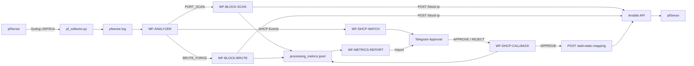

# CHA3P07 Network Automation 2026

Automated network monitoring, threat detection, incident response, DHCP device approval, and performance measurement using **pfSense, Python, n8n, Ansible, and Telegram**.

---

## 1. Overview

This project implements a lab-scale network security automation system that collects pfSense logs, detects suspicious activity, automatically responds to security incidents, handles unknown DHCP devices through human approval, and records performance metrics for evaluation.

The system currently supports four main automation capabilities:

- **Port Scan Detection and Automatic IP Blocking**
- **SSH / Connection-Flood Brute-Force Detection**
- **Unknown DHCP Device Approval via Telegram**
- **Performance Reporting for Automated Responses**

The project is designed for academic and laboratory use in network automation, security orchestration, and automated incident response.

---

## 2. System Architecture



### High-Level Flow

```text
pfSense
   ↓ Syslog
pf_collector.py
   ↓
pfsense.log
   ↓
WF-ANALYZER
   ├── PORT_SCAN ───→ WF-BLOCK-SCAN ───→ Ansible
   ├── BRUTE_FORCE ─→ WF-BLOCK-BRUTE ──→ Ansible
   └── DHCP ────────→ WF-DHCP-WATCH
                           ↓
                        Telegram
                           ↓
                    APPROVE / REJECT
                           ↓
                    WF-DHCP-CALLBACK
                           ↓
                         Ansible
```

---

## 3. Main Components

| Component | Role |
|---|---|
| **pfSense** | Firewall, DHCP service, and source of network logs |
| **pf_collector.py** | Receives pfSense Syslog over UDP and stores logs |
| **WF-ANALYZER** | Parses logs, detects threats, deduplicates incidents, and routes DHCP events |
| **WF-BLOCK-SCAN** | Blocks IP addresses detected as port scanners |
| **WF-BLOCK-BRUTE** | Blocks IP addresses detected as brute-force attackers |
| **WF-DHCP-WATCH** | Detects previously unknown MAC addresses |
| **WF-DHCP-CALLBACK** | Processes Telegram APPROVE / REJECT actions |
| **Ansible API** | Applies firewall and DHCP configuration to pfSense |
| **WF-METRICS-REPORT** | Builds automation performance reports and sends them to Telegram |

---

## 4. Detection Rules

The current Analyzer uses the following thresholds:

| Detection | Threshold | Window |
|---|---:|---:|
| SSH Brute Force | 5 failed authentication events | 60 seconds |
| Connection Flood / Brute Force | 8 attempts to the same service | 60 seconds |
| Port Scan | 15 distinct destination ports | 10 seconds |

### Detection Priority

For each source IP, the Analyzer evaluates events in the following order:

```text
SSH Brute Force
        ↓
Connection-Flood Brute Force
        ↓
Port Scan
```

The Analyzer is responsible for deciding whether an event is malicious. Downstream workflows only execute the corresponding automation action.

---

## 5. Incident Deduplication

The project uses multiple deduplication layers to prevent the same incident from repeatedly triggering automation.

### Analyzer-Level Dedupe

Current incident quiet periods:

```text
PORT_SCAN    → 20 seconds
BRUTE_FORCE  → 70 seconds
```

The Analyzer tracks incident state using n8n workflow static data.

### Block Workflow Dedupe

`WF-BLOCK-SCAN` and `WF-BLOCK-BRUTE` use:

```javascript
staticData.blocked
```

to prevent the same IP from being sent repeatedly to Ansible during consecutive polling cycles.

---

## 6. DHCP Device Approval

Unknown DHCP devices are handled through a human-in-the-loop approval process.

```text
New DHCP Device
      ↓
WF-ANALYZER
      ↓
WF-DHCP-WATCH
      ↓
Check approved / rejected / pending MAC lists
      ↓
Unknown MAC
      ↓
Telegram Approval Request
      ↓
  ┌─────────────┐
  │             │
APPROVE       REJECT
  │             │
  ↓             ↓
Choose IP   rejected_macs.txt
  ↓
Ansible /add-static-mapping
  ↓
pfSense DHCP Mapping
  ↓
Verify DHCPACK
  ↓
approved_macs.txt
```

The current approval IP pool is:

```text
192.168.12.11 - 192.168.12.199
```

Device state is stored in:

```text
approved_macs.txt
pending_macs.txt
rejected_macs.txt
```

---

## 7. Performance Metrics

All automation scenarios write performance data to:

```text
C:/Users/Administrator/.n8n-files/metrics/processing_metrics.jsonl
```

Current scenarios:

```text
BLOCK_SCAN
BLOCK_BRUTE
APPROVE_MAC
```

For security automation:

```text
T0 = source_event_at_ms
T1 = analyzer_detected_at_ms
T2 = processing_finished_at_ms
```

Metrics can be interpreted as:

```text
Detection Delay       = T1 - T0
Automation Response   = T2 - T1
End-to-End Time       = T2 - T0
```

The current block workflows primarily measure:

```text
T2 - T1
```

For DHCP approval, reporting focuses on the automation period after the administrator selects **APPROVE**, so human reaction time does not distort system performance.

### Telegram Reports

Supported commands include:

```text
/report
/report scan
/report brute
/report approve
/report dhcp
```

Reports include:

- Success rate
- Average processing time
- Median
- Minimum
- Maximum
- P95
- Latest processed event

---

## 8. Repository Structure

```text
CHA3P07-Network-Automation-2026/
│
├── README.md
├── pf_collector.py
│
└── n8n/
    ├── WF-ANALYZER — Detect + Dedupe + Log & Audit + Route DHCP.json
    ├── WF-BLOCK-SCAN — Read Port-Scan Bans → Ansible.json
    ├── WF-BLOCK-BRUTE — Read Brute-Force Bans → Ansible + Telegram.json
    ├── WF-DHCP-WATCH — Detect New Device → Telegram (Approve-Reject).json
    ├── WF-DHCP-CALLBACK.json
    └── WF-METRICS-REPORT — Telegram Performance Report.json
```

The current repository contains the Python collector and n8n workflow layer.

The Ansible/API implementation used by these workflows runs separately and is not currently included in this repository.

---

## 9. Runtime Files

The current workflows expect runtime files under:

```text
C:/Users/Administrator/.n8n-files/
```

Recommended structure:

```text
.n8n-files/
│
├── pflogs/
│   ├── pfsense.log
│   ├── BanIP_Scanport.txt
│   ├── BanIP_Bruteforce.txt
│   ├── BanEvent_Scanport.jsonl
│   ├── BanEvent_Bruteforce.jsonl
│   ├── analyzer_events.log
│   ├── approved_macs.txt
│   ├── rejected_macs.txt
│   ├── pending_macs.txt
│   └── DeviceEvent_Approval.jsonl
│
├── metrics/
│   └── processing_metrics.jsonl
│
└── telegram/
    └── report_offset.txt
```

---

## 10. Quick Start

### 1. Clone the Repository

```bash
git clone https://github.com/minhhung8712/CHA3P07-Network-Automation-2026.git
cd CHA3P07-Network-Automation-2026
```

### 2. Configure the Collector

Review the following values in `pf_collector.py`:

```python
LISTEN_IP
LISTEN_PORT
PFSENSE_IP
LOG_DIR
ONLY_ACCEPT_FROM_PFSENSE
```

The default Syslog listener uses:

```text
UDP/514
```

### 3. Configure pfSense Remote Logging

Send the required pfSense logs to the host running `pf_collector.py`.

Example:

```text
Destination: <collector-ip>:514
Protocol: UDP
```

### 4. Start the Collector

```bash
python pf_collector.py
```

Verify that:

```text
pfsense.log
```

is receiving pfSense messages.

### 5. Import n8n Workflows

Recommended logical order:

```text
1. WF-DHCP-WATCH
2. WF-ANALYZER
3. WF-BLOCK-SCAN
4. WF-BLOCK-BRUTE
5. WF-DHCP-CALLBACK
6. WF-METRICS-REPORT
```

After importing into another n8n instance, verify workflow IDs, credentials, file paths, and API addresses.

---

## 11. Lab-Specific Configuration

The current project contains values specific to the laboratory environment, including:

```text
pfSense:      192.168.10.1
Ansible API:  192.168.10.3:8000
DHCP Pool:    192.168.12.11 - 192.168.12.199
```

Internal network prefixes currently include:

```text
192.168.10.*
192.168.11.*
192.168.12.*
192.168.20.*
```

These values must be reviewed before deployment in another environment.

---

## 12. Security Notice

This project is intended primarily for laboratory and academic use.

Before using it in a production environment:

- Disable or remove `LAB_RESET`
- Move all secrets to n8n Credentials or environment variables
- Rotate any credential that has previously been committed to Git
- Restrict access to the Ansible API
- Add authentication to automation API endpoints
- Validate all IP and MAC input
- Enable `ONLY_ACCEPT_FROM_PFSENSE`
- Ensure Ansible playbooks are idempotent
- Apply least-privilege filesystem permissions
- Add structured retry and error handling

> Never store Telegram Bot API tokens or other secrets directly in exported workflow JSON files.

---

## 13. Known Repository Issue

The current `WF-BLOCK-SCAN — Read Port-Scan Bans → Ansible.json` file contains two workflow JSON objects concatenated together.

The older inactive workflow should be removed so that the file contains only one valid n8n workflow JSON document before importing it into another n8n instance.

---

## 14. Documentation

This README provides a high-level overview of the project.

Detailed technical documentation can be separated into the following files:

```text
docs/
├── architecture.md
├── detection-logic.md
├── dhcp-automation.md
├── metrics.md
├── deployment.md
└── security-notes.md
```

These documents can cover internal workflow logic, timestamp correlation, deduplication behaviour, DHCP approval flow, deployment steps, and production-hardening recommendations in greater detail.

---

## 15. Project Scope

This project demonstrates practical concepts in:

- Network Automation
- Security Orchestration
- Automated Incident Response
- pfSense Integration
- n8n Workflow Automation
- Ansible Automation
- Network Performance Measurement
- Human-in-the-Loop Security Decisions

The overall design moves from:

```text
Manual Detection → Manual Response
```

toward:

```text
Collect → Detect → Decide → Automate → Verify → Measure
```

while keeping human approval for network-access decisions where appropriate.

---

## License

No license file is currently included in this repository.
