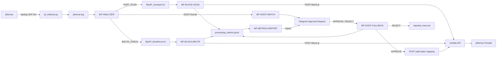

# CHA3P07 Network Automation 2026

Automated network monitoring, threat detection, incident response, DHCP device approval, and performance measurement using **pfSense, Python, n8n, Ansible, and Telegram**.

---

## 1. Overview

This project implements a lab-scale network security automation system designed around the following pipeline:

```text
pfSense
   ↓ Syslog UDP/514
Python Syslog Collector
   ↓
pfsense.log
   ↓
n8n WF-ANALYZER
   ├── Port Scan Detection
   ├── Brute-Force Detection
   └── DHCP Event Routing
          ↓
   ┌──────┴───────────────────────────┐
   ↓                                  ↓
Security Response                 DHCP Approval
   ↓                                  ↓
Ansible API                       Telegram
   ↓                                  ↓
pfSense Firewall               APPROVE / REJECT
   ↓                                  ↓
Metrics                         Static DHCP Mapping
   └───────────────┬──────────────────┘
                   ↓
         processing_metrics.jsonl
                   ↓
          Telegram /report
```

The main objective is to demonstrate how network events can be automatically collected, analysed, acted upon, audited, and measured without requiring an administrator to manually inspect every log entry.

The system currently supports three primary automation scenarios:

1. **Port Scan Detection and Automatic IP Blocking**
2. **Brute-Force Detection and Automatic IP Blocking**
3. **Unknown DHCP Device Detection with Telegram Approval**

Performance metrics are collected for each automated response so that the end-to-end processing time can be evaluated.

---

# 2. System Architecture



---

# 3. Design Principle

A core architectural principle of this project is **separation of responsibilities**.

The Python collector does **not** decide whether an event is a port scan, brute-force attack, DHCP request, or another type of traffic.

Its only responsibilities are:

```text
Receive → Timestamp → Store → Rotate
```

All security analysis is performed by the n8n `WF-ANALYZER`.

This separation keeps the collector simple and allows new detection logic to be added without modifying the syslog collection layer.

---

# 4. Repository Structure

```text
CHA3P07-Network-Automation-2026/
│
├── README.md
│
├── pf_collector.py
│
└── n8n/
    │
    ├── WF-ANALYZER — Detect + Dedupe + Log & Audit + Route DHCP.json
    │
    ├── WF-BLOCK-SCAN — Read Port-Scan Bans → Ansible.json
    │
    ├── WF-BLOCK-BRUTE — Read Brute-Force Bans → Ansible + Telegram.json
    │
    ├── WF-DHCP-WATCH — Detect New Device → Telegram (Approve-Reject).json
    │
    ├── WF-DHCP-CALLBACK.json
    │
    └── WF-METRICS-REPORT — Telegram Performance Report.json
```

> The current repository contains the n8n orchestration layer and Python syslog collector.
> The Ansible/API implementation used by the workflows is expected to run separately and is not currently included in this repository.

---

# 5. Components

## 5.1 pfSense

pfSense acts as:

* Network firewall
* Source of firewall/filter logs
* Source of DHCP logs
* Enforcement point for blocked IP addresses
* Target for static DHCP mappings

pfSense forwards its syslog messages to the machine running `pf_collector.py`.

Example architecture:

```text
pfSense
192.168.10.1
      │
      │ UDP/514
      ▼
Collector / n8n Host
```

---

# 6. Python Syslog Collector

File:

```text
pf_collector.py
```

The collector listens for pfSense syslog packets over UDP.

Default configuration:

```python
LISTEN_IP = "0.0.0.0"
LISTEN_PORT = 514

PFSENSE_IP = "192.168.10.1"

LOG_DIR = r"C:\Users\Administrator\.n8n-files\pflogs"
ACTIVE_LOG_NAME = "pfsense.log"

ROTATE_MAX_BYTES = 5 * 1024 * 1024
```

Every received message is stored using the following format:

```text
<UTC_RECEIVE_TIMESTAMP>\t<RAW_PFSENSE_LOG>
```

Example:

```text
2026-09-18T08:30:14.124000+00:00    <raw pfSense syslog message>
```

The collector intentionally stores **all log categories in one file**:

```text
pfsense.log
```

This can include:

* `filterlog`
* `sshd`
* `dhcpd`
* system events
* OpenVPN logs
* IPsec logs
* other pfSense syslog events

The collector does not perform threat classification.

---

## 6.1 Log Rotation

When:

```text
pfsense.log >= 5 MB
```

the file is renamed to:

```text
pfsense_YYYYMMDD_HHMMSS_microseconds.log
```

and a new `pfsense.log` is automatically created.

Example:

```text
pfsense_20260918_153022_123456.log
```

---

# 7. WF-ANALYZER

Workflow:

```text
WF-ANALYZER — Detect + Dedupe + Log & Audit + Route DHCP
```

The Analyzer is the main detection engine of the system.

It runs every:

```text
10 seconds
```

and reads:

```text
C:/Users/Administrator/.n8n-files/pflogs/pfsense.log
```

Its responsibilities include:

```text
Read logs
   ↓
Parse traffic
   ↓
Ignore trusted/internal traffic
   ↓
Detect attacks
   ↓
Incident deduplication
   ↓
Create event metadata
   ↓
Write Ban/Event files
   ↓
Route DHCP events
```

---

# 8. Network Filtering

The Analyzer currently treats the following network prefixes as internal:

```javascript
192.168.10.*
192.168.11.*
192.168.12.*
192.168.20.*
```

The following prefixes are ignored:

```text
169.254.*
224.*
239.*
255.*
0.*
127.*
```

Specific addresses currently ignored include:

```text
192.168.183.1
192.168.10.1
```

These values are lab-specific and should be modified when the project is deployed in another environment.

---

# 9. Threat Detection Logic

The Analyzer currently implements three detection methods.

| Detection                      |                      Threshold | Time Window | Purpose                                                                   |
| ------------------------------ | -----------------------------: | ----------: | ------------------------------------------------------------------------- |
| SSH Brute Force                | 5 failed authentication events |  60 seconds | Detect repeated SSH login failures                                        |
| Connection Flood / Brute Force | 8 connections to the same port |  60 seconds | Detect brute force when firewall blocks traffic before SSH authentication |
| Port Scan                      |  15 distinct destination ports |  10 seconds | Detect multi-port scanning                                                |

---

## 9.1 SSH Brute Force

The Analyzer searches for SSH authentication messages similar to:

```text
Failed password for ...
```

Events are grouped by source IP.

An attack is detected when:

```text
Failed authentication count >= 5
within 60 seconds
```

The result is classified as:

```text
BRUTE_FORCE
```

---

## 9.2 Connection Flood / Firewall-Level Brute Force

Sometimes tools such as Hydra may attack a service while pfSense blocks the connection before the application generates an authentication failure.

Therefore, relying only on:

```text
Failed password
```

would miss these attempts.

The Analyzer also examines repeated SYN/firewall events.

An incident is classified as brute force when approximately:

```text
>= 8 events
within 60 seconds
targeting primarily one destination port
```

while:

```text
distinct destination ports < 15
```

This separates concentrated attacks against one service from a multi-port scan.

---

## 9.3 Port Scan

A port scan is detected when one external source reaches:

```text
>= 15 distinct destination ports
within 10 seconds
```

The resulting event is classified as:

```text
PORT_SCAN
```

---

# 10. Detection Priority

For each source IP, the Analyzer evaluates events in approximately the following order:

```text
SSH Brute Force
        ↓
Connection-Flood Brute Force
        ↓
Port Scan
```

Once a matching security finding has been generated for the analysed event set, it is handled by the corresponding incident workflow.

---

# 11. Incident Deduplication

The project uses multiple levels of deduplication to prevent the same attacker from repeatedly triggering identical automation actions.

## Analyzer-Level Incident Deduplication

The Analyzer stores incident state using n8n workflow static data.

Current quiet periods are:

```text
PORT_SCAN    → 20 seconds
BRUTE_FORCE  → 70 seconds
```

The Analyzer compares both:

```text
last_signal_at_ms
```

and:

```text
last_seen_at_ms
```

This provides two layers of duplicate protection:

```text
Layer 1:
Timestamp from the actual network log

Layer 2:
Analyzer wall-clock timestamp
```

If another detection occurs during the same incident window, the Analyzer does not generate another:

```text
event_id
BanIP entry
BanEvent entry
Audit event
Ansible action
```

After the quiet period expires, another attack may be treated as a new incident.

---

# 12. Security Event Files

Port-scan events use:

```text
BanIP_Scanport.txt
BanEvent_Scanport.jsonl
```

Brute-force events use:

```text
BanIP_Bruteforce.txt
BanEvent_Bruteforce.jsonl
```

The IP files provide a simple queue for the blocking workflows.

The JSONL event files retain richer event metadata including identifiers and timestamps used for correlation and performance measurement.

---

# 13. WF-BLOCK-SCAN

Workflow:

```text
WF-BLOCK-SCAN — Read Port-Scan Bans → Ansible
```

Runs every:

```text
10 seconds
```

and reads:

```text
BanIP_Scanport.txt
```

The workflow performs:

```text
Read BanIP_Scanport
        ↓
Filter New IPs
        ↓
Find matching Analyzer event
        ↓
POST /block-ip
        ↓
pfSense firewall change
        ↓
Finish processing timer
        ↓
Write metrics
        ↓
Telegram notification
```

---

## 13.1 Block-Level Deduplication

A second duplicate-protection layer exists inside the blocking workflow.

It uses:

```javascript
staticData.blocked
```

Conceptually:

```javascript
staticData.blocked = Array.isArray(staticData.blocked)
  ? staticData.blocked
  : [];
```

Before an IP is passed to Ansible, the workflow verifies that the IP has not already been processed in the current stored state.

This protects against cases where the same IP remains in the Ban file across multiple polling cycles.

---

# 14. WF-BLOCK-BRUTE

Workflow:

```text
WF-BLOCK-BRUTE — Read Brute-Force Bans → Ansible + Telegram
```

Its structure is similar to the port-scan workflow.

It reads:

```text
BanIP_Bruteforce.txt
```

and correlates the IP with:

```text
BanEvent_Bruteforce.jsonl
```

The most recent matching Analyzer event is retrieved by:

```text
Find Analyzer Event
```

This node is important for performance measurement.

It is **not the node that decides whether an attack exists**.

Attack detection has already occurred inside:

```text
WF-ANALYZER
```

`Find Analyzer Event` correlates the blocked IP with the Analyzer event so that timestamps such as:

```text
event_id
source_event_at_ms
analyzer_detected_at_ms
```

can be carried into the final metrics record.

---

# 15. Ansible Block API

Both security-response workflows call:

```http
POST http://192.168.10.3:8000/block-ip
```

Example payload:

```json
{
  "ip": "ATTACKER_IP",
  "reason": "PORT_SCAN detected by n8n analyzer"
}
```

or an equivalent brute-force reason.

Conceptually:

```text
n8n
 ↓ HTTP POST
Ansible API
 ↓
Ansible Playbook
 ↓
pfSense
 ↓
Firewall rule / alias updated
```

The Ansible implementation should ideally be **idempotent** so that requesting the same block multiple times does not create conflicting or duplicated firewall state.

---

# 16. Lab Reset Mechanism

The blocking workflows currently contain a lab testing mechanism named:

```text
LAB_RESET
```

A test IP currently used by the project is:

```text
192.168.183.133
```

During repeated experiments, changing the reset token allows the same test IP to be processed again even if it already exists in:

```javascript
staticData.blocked
```

Example concept:

```text
brute-test-001
brute-test-002
brute-test-003
```

This mechanism is useful for laboratory testing but should be **disabled or removed in production**.

---

# 17. DHCP Automation

DHCP automation consists of two workflows:

```text
WF-DHCP-WATCH
WF-DHCP-CALLBACK
```

The process is:

```text
New device sends DHCP request
        ↓
pfSense logs DHCP event
        ↓
Collector writes pfsense.log
        ↓
WF-ANALYZER identifies DHCP event
        ↓
WF-DHCP-WATCH
        ↓
Check MAC against known device lists
        ↓
Unknown MAC
        ↓
Telegram approval request
       / \
 APPROVE REJECT
    ↓       ↓
Callback   rejected_macs.txt
    ↓
Choose IP
    ↓
Ansible /add-static-mapping
    ↓
pfSense DHCP mapping
    ↓
Wait for DHCPACK
    ↓
approved_macs.txt
    ↓
Metrics
```

---

# 18. DHCP Device Lists

The DHCP subsystem maintains three states.

## Approved

```text
approved_macs.txt
```

Typical format:

```text
MAC,IP,HOSTNAME
```

Example:

```text
aa:bb:cc:dd:ee:ff,192.168.12.11,laptop01
```

---

## Pending

```text
pending_macs.txt
```

Typical format:

```text
MAC,HOSTNAME
```

Example:

```text
aa:bb:cc:dd:ee:ff,laptop01
```

---

## Rejected

```text
rejected_macs.txt
```

Contains MAC addresses/devices rejected by the administrator.

---

# 19. WF-DHCP-WATCH

`WF-DHCP-WATCH` receives DHCP content from `WF-ANALYZER`.

The workflow parses events such as:

```text
DHCPDISCOVER
DHCPREQUEST
DHCPOFFER
DHCPACK
```

Events belonging to the same MAC address are grouped together.

This is useful because:

```text
DHCPDISCOVER
```

may not always contain a hostname, while later events such as:

```text
DHCPREQUEST
DHCPOFFER
DHCPACK
```

may provide additional device information.

The workflow compares each detected MAC against:

```text
approved_macs.txt
rejected_macs.txt
pending_macs.txt
```

Only an unknown MAC generates a new Telegram approval request.

---

# 20. Telegram Device Approval

For an unknown device, Telegram displays information similar to:

```text
MAC: aa:bb:cc:dd:ee:ff
Hostname: laptop01

Chọn APPROVE để cấp IP, REJECT để không cấp IP.
```

The administrator receives two inline buttons:

```text
✅ APPROVE
⛔ REJECT
```

Their callback values are conceptually:

```text
approve|MAC_ADDRESS
reject|MAC_ADDRESS
```

When the request is generated, an approval event is also created with:

```text
scenario = APPROVE_MAC
status   = pending_approval
```

and stored in:

```text
DeviceEvent_Approval.jsonl
```

---

# 21. WF-DHCP-CALLBACK

The callback workflow polls Telegram every:

```text
5 seconds
```

and processes only callback queries generated by the approval buttons.

Normal Telegram messages such as:

```text
/report
```

are ignored by this workflow.

---

## 21.1 APPROVE

When the administrator selects APPROVE:

```text
Telegram callback
      ↓
Resolve MAC in pending_macs.txt
      ↓
Choose available IP
      ↓
POST /add-static-mapping
      ↓
Wait
      ↓
Read pfsense.log
      ↓
Find DHCPACK for MAC
      ↓
Write approved_macs.txt
      ↓
Record performance metric
```

The current address pool is:

```text
192.168.12.11
       ↓
192.168.12.199
```

The workflow selects the first IP that is not already present in `approved_macs.txt`.

---

# 22. Ansible Static Mapping API

DHCP approval calls:

```http
POST http://192.168.10.3:8000/add-static-mapping
```

Example payload:

```json
{
  "client_mac": "aa:bb:cc:dd:ee:ff",
  "ip": "192.168.12.11",
  "hostname": "laptop01"
}
```

The Ansible layer is then responsible for applying the static mapping to pfSense.

---

# 23. REJECT

When REJECT is selected, the device is written to:

```text
rejected_macs.txt
```

The same device will therefore not continuously generate new approval requests.

---

# 24. Performance Measurement

All current scenarios write metrics to the central file:

```text
C:/Users/Administrator/.n8n-files/metrics/processing_metrics.jsonl
```

Scenarios include:

```text
BLOCK_SCAN
BLOCK_BRUTE
APPROVE_MAC
```

---

# 25. Security Automation Timing

For port-scan and brute-force blocking, the main metric is:

```text
analyzer_detected_at_ms
        ↓
processing_finished_at_ms
```

Therefore:

```text
total_processing_ms
    =
processing_finished_at_ms
    -
analyzer_detected_at_ms
```

This measures the automation time after the Analyzer has decided that the event qualifies as an attack.

The event also contains:

```text
source_event_at_ms
```

which can be used to evaluate the earlier stage:

```text
Source Event
    ↓
Analyzer Detection
```

Conceptually:

```text
T0 = source_event_at_ms
T1 = analyzer_detected_at_ms
T2 = processing_finished_at_ms
```

Then:

```text
Detection delay     = T1 - T0
Automation response = T2 - T1
End-to-end          = T2 - T0
```

The current `total_processing_*` metric for the block workflows primarily measures:

```text
T2 - T1
```

---

# 26. DHCP Timing

The DHCP scenario tracks both the complete workflow and the automation period after human approval.

Important timestamps include:

```text
New MAC detected
approved_at_ms
processing_finished_at_ms
```

The workflow can therefore distinguish between:

```text
Time waiting for administrator approval
```

and:

```text
Automation time after APPROVE
```

For reporting, the DHCP performance report prioritises:

```text
APPROVE received
       ↓
DHCPACK verified
```

so administrator reaction time does not distort the automation-performance measurement.

---

# 27. Metrics Example

A security metric is conceptually stored as:

```json
{
  "scenario": "BLOCK_SCAN",
  "event_id": "SCAN-...",
  "ip": "192.168.x.x",
  "status": "success",
  "analyzer_detected_at_ms": 0,
  "analyzer_detected_at": "ISO-8601",
  "processing_finished_at_ms": 0,
  "processing_finished_at": "ISO-8601",
  "total_processing_ms": 0,
  "total_processing_seconds": 0
}
```

DHCP metrics additionally include information such as:

```text
MAC
hostname
approved_at
processing_finished_at
```

---

# 28. WF-METRICS-REPORT

Workflow:

```text
WF-METRICS-REPORT — Telegram Performance Report
```

It polls Telegram every:

```text
5 seconds
```

and reads:

```text
processing_metrics.jsonl
```

when a `/report` command is received.

Supported commands include:

```text
/report
/report scan
/report brute
/report approve
/report dhcp
```

Conceptually:

```text
/report
```

returns all scenarios.

```text
/report scan
```

filters:

```text
BLOCK_SCAN
```

```text
/report brute
```

filters:

```text
BLOCK_BRUTE
```

```text
/report approve
```

or:

```text
/report dhcp
```

filters:

```text
APPROVE_MAC
```

---

# 29. Report Statistics

The performance report calculates:

```text
Total records
Successful records
Failed records
Success rate
Average
Median
Minimum
Maximum
P95
Latest event
Latest processing time
```

Invalid timing values are excluded from performance statistics rather than silently contaminating the results.

Telegram update state is maintained using:

```text
report_offset.txt
```

to prevent old `/report` messages from being repeatedly processed.

---

# 30. Required Runtime Directories

The current workflows expect files under:

```text
C:/Users/Administrator/.n8n-files/
```

Recommended structure:

```text
.n8n-files/
│
├── pflogs/
│   ├── pfsense.log
│   ├── BanIP_Scanport.txt
│   ├── BanIP_Bruteforce.txt
│   ├── BanEvent_Scanport.jsonl
│   ├── BanEvent_Bruteforce.jsonl
│   ├── analyzer_events.log
│   ├── approved_macs.txt
│   ├── rejected_macs.txt
│   ├── pending_macs.txt
│   └── DeviceEvent_Approval.jsonl
│
├── metrics/
│   └── processing_metrics.jsonl
│
└── telegram/
    └── report_offset.txt
```

Empty files may need to be created before activating workflows that expect them to exist.

---

# 31. Requirements

The project requires:

```text
pfSense
Python 3
n8n with local filesystem access
Ansible automation service/API
Telegram Bot
Windows/Linux host capable of receiving pfSense syslog
Network connectivity between n8n, Ansible API, and pfSense
```

The paths currently committed to the workflows are Windows-specific.

---

# 32. Installation

Clone the repository:

```bash
git clone https://github.com/minhhung8712/CHA3P07-Network-Automation-2026.git
cd CHA3P07-Network-Automation-2026
```

Create the required directories and files.

Update configuration in:

```text
pf_collector.py
```

including:

```text
PFSENSE_IP
LOG_DIR
LISTEN_IP
LISTEN_PORT
```

For a non-lab environment, consider enabling:

```python
ONLY_ACCEPT_FROM_PFSENSE = True
```

---

# 33. Configure pfSense Syslog

Configure pfSense Remote Logging so that required logs are sent to the collector machine.

Example:

```text
Destination:
<collector-ip>:514

Protocol:
UDP
```

The Windows/Linux firewall on the collector host must also permit incoming UDP traffic on the configured syslog port.

---

# 34. Start the Collector

Example:

```bash
python pf_collector.py
```

Expected output is similar to:

```text
[collector] nghe syslog UDP 0.0.0.0:514
[collector] pfsense.log <- TẤT CẢ log
[collector] thu muc: ...
```

Verify that:

```text
pfsense.log
```

begins receiving pfSense messages.

---

# 35. Import n8n Workflows

Import the workflow JSON files into the same n8n instance.

Recommended logical order:

```text
1. WF-DHCP-WATCH
2. WF-ANALYZER
3. WF-BLOCK-SCAN
4. WF-BLOCK-BRUTE
5. WF-DHCP-CALLBACK
6. WF-METRICS-REPORT
```

`WF-ANALYZER` calls `WF-DHCP-WATCH` as a sub-workflow, so the referenced workflow ID must match the imported workflow in the target n8n instance.

After importing to another n8n instance, verify all workflow references.

---

# 36. Environment-Specific Values

Before activation, review all hard-coded values such as:

```text
192.168.10.1
192.168.10.3
192.168.12.*
C:/Users/Administrator/.n8n-files/
Telegram Chat ID
Telegram credentials
n8n workflow IDs
```

These values belong to the current lab topology and should not be assumed to work in another environment.

---

# 37. Telegram Configuration

Create a Telegram bot using BotFather and configure its credential in n8n.

Use n8n Credentials or environment variables for secrets.

Do **not** store the Telegram Bot API token directly in exported workflow JSON files.

---

# 38. Security Warning

The current repository version contains Telegram API credentials embedded directly in some exported workflow definitions.

If the credential has ever been committed to a remotely accessible repository, it should be considered exposed.

Recommended response:

```text
1. Revoke/rotate the affected Telegram bot token.
2. Create a new token.
3. Store the replacement using n8n Credentials or environment variables.
4. Remove hard-coded secrets from workflow JSON.
5. Review Git history if the repository has been shared publicly.
```

Deleting the token only from the latest file does not invalidate an already exposed credential.

---

# 39. Testing

## Port Scan

Generate traffic reaching at least:

```text
15 distinct destination ports
within 10 seconds
```

Expected result:

```text
WF-ANALYZER
    ↓
PORT_SCAN
    ↓
BanIP_Scanport.txt
    ↓
WF-BLOCK-SCAN
    ↓
Ansible /block-ip
    ↓
Metrics
```

---

## SSH Brute Force

Generate at least:

```text
5 Failed password events
within 60 seconds
```

Expected classification:

```text
BRUTE_FORCE
```

---

## Firewall-Level Brute Force

Generate repeated attempts against one destination port.

Expected condition:

```text
>= 8 events / 60 seconds
and
distinct ports < 15
```

Expected classification:

```text
BRUTE_FORCE
```

---

## DHCP Device Approval

Connect a previously unknown MAC address.

Expected flow:

```text
DHCP event
   ↓
Telegram request
   ↓
APPROVE
   ↓
Static IP allocation
   ↓
Ansible mapping
   ↓
DHCPACK verification
   ↓
approved_macs.txt
```

---

## Metrics

Send:

```text
/report
```

or:

```text
/report scan
/report brute
/report approve
```

and verify that Telegram returns performance statistics.

---

# 40. Known Issues in the Current Repository

## WF-BLOCK-SCAN JSON

The current:

```text
WF-BLOCK-SCAN — Read Port-Scan Bans → Ansible.json
```

contains **two complete n8n workflow JSON objects concatenated in the same file**.

The first object is the newer active workflow containing metrics support.

The second object appears to be an older inactive version.

As a result, the file as currently committed is not a valid single JSON document and may fail when imported directly into n8n.

The older workflow object should be removed so that the file contains only one exported workflow.

---

## Hard-Coded Telegram Credentials

Some workflow exports contain Telegram bot API credentials directly in request URLs.

These should be removed and the affected bot credential rotated.

---

## Local Absolute Paths

Most workflows currently use absolute paths such as:

```text
C:/Users/Administrator/.n8n-files/
```

This reduces portability.

A future version should move these locations to environment variables or a standard configurable base path.

---

## Active Log Rotation

`WF-ANALYZER` currently reads:

```text
pfsense.log
```

while the collector rotates completed files to:

```text
pfsense_<timestamp>.log
```

The current Analyzer does not automatically process historical rotated files.

This is acceptable under normal lab traffic but could become a limitation if the active log rotates faster than the Analyzer can process it.

---

## n8n Static Data

Several deduplication mechanisms depend on:

```text
$getWorkflowStaticData(...)
```

State behaviour should therefore be tested carefully across workflow restarts, redeployments, backup/restore operations, and changes between manual and triggered execution.

---

# 41. Production Hardening Recommendations

Before using this architecture outside a laboratory environment:

```text
Disable LAB_RESET
Rotate exposed credentials
Move secrets to n8n Credentials
Restrict Ansible API network access
Authenticate Ansible API requests
Enable ONLY_ACCEPT_FROM_PFSENSE
Validate every IP/MAC received by automation APIs
Use TLS where appropriate
Apply least-privilege filesystem permissions
Centralise configuration using environment variables
Add structured error/retry handling
Ensure Ansible playbooks are idempotent
Persist deduplication state in durable storage if required
Protect log and metrics files against unauthorised modification
Implement log retention and cleanup
Monitor collector and workflow health
```

---

# 42. Current Automation Scenarios

| Scenario            | Detection / Trigger               | Action                             | Metric Scenario |
| ------------------- | --------------------------------- | ---------------------------------- | --------------- |
| Port Scan           | ≥15 distinct ports / 10 s         | Block source IP                    | `BLOCK_SCAN`    |
| SSH Brute Force     | ≥5 failed logins / 60 s           | Block source IP                    | `BLOCK_BRUTE`   |
| Connection Flood    | ≥8 attempts / 60 s to one service | Block source IP                    | `BLOCK_BRUTE`   |
| Unknown DHCP Device | New unrecognised MAC              | Telegram approval + static mapping | `APPROVE_MAC`   |

---

# 43. Project Flow Summary

```text
                        NETWORK
                           │
                           ▼
                       pfSense
                           │
                      Syslog UDP
                           │
                           ▼
                   pf_collector.py
                           │
                           ▼
                     pfsense.log
                           │
                           ▼
                     WF-ANALYZER
                    /      |       \
                   /       |        \
                  ▼        ▼         ▼
            PORT_SCAN   BRUTE     DHCP DEVICE
                │          │          │
                ▼          ▼          ▼
           Ban Scan    Ban Brute   DHCP Watch
                │          │          │
                ▼          ▼          ▼
           Block Scan  Block Brute Telegram
                 \         /          │
                  \       /      Approve/Reject
                   ▼     ▼            │
                  Ansible             ▼
                     \          DHCP Callback
                      \              /
                       ▼            ▼
                            pfSense
                               │
                               ▼
                    processing_metrics.jsonl
                               │
                               ▼
                       Metrics Report
                               │
                               ▼
                           Telegram
```

---

# 44. Scope

This project is primarily designed for laboratory and academic experimentation in:

```text
Network Automation
Security Orchestration
Automated Incident Response
Infrastructure Automation
pfSense Integration
n8n Workflow Automation
Ansible Automation
Network Performance Measurement
Human-in-the-Loop Security Decisions
```

It demonstrates a practical transition from:

```text
Detect manually → Respond manually
```

to:

```text
Collect → Detect → Decide → Automate → Verify → Measure
```

while still retaining human approval for device-access decisions where appropriate.

---

# 45. Future Improvements

Potential future development includes:

```text
Persistent database instead of flat-file queues
Central configuration file
Dockerised deployment
Authenticated Ansible API
TLS between automation components
Prometheus/Grafana metrics
Long-term event database
Dashboard for incidents and devices
Automatic unblock / cooldown policy
Distributed brute-force detection
Slow port-scan detection
Rate-based anomaly detection
Webhook-based Telegram updates
Automated retry with idempotency keys
Improved false-positive evaluation
Unit/integration testing
CI validation of n8n JSON exports
```

---

# 46. License

No license file is currently included in this repository.

Add an appropriate open-source or project-specific license before distributing or reusing the project outside its intended academic scope.
