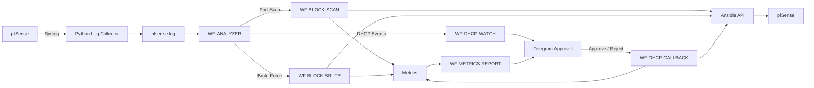

# CHA3P07 Network Automation 2026

Automated network monitoring, threat detection, incident response, DHCP device approval, and performance reporting using **pfSense, Python, n8n, Ansible, and Telegram**.

---

## 1. Overview

This project implements a network automation and security orchestration system that collects logs from pfSense, analyzes network activity, detects suspicious behavior, triggers automated response workflows, manages new DHCP devices through administrator approval, and records system performance for evaluation.

The project focuses on four main capabilities:

- **Port Scan Detection and Automated Response**
- **Brute-Force Detection and Automated Response**
- **Unknown DHCP Device Approval**
- **Automation Performance Reporting**

The system is designed as a modular workflow-based architecture, where each component has a clear responsibility.

---

## 2. System Architecture



### High-Level Flow

```text
pfSense
   ↓
Python Log Collector
   ↓
pfsense.log
   ↓
WF-ANALYZER
   ├── Port Scan ───→ WF-BLOCK-SCAN ───→ Ansible
   ├── Brute Force ─→ WF-BLOCK-BRUTE ──→ Ansible
   └── DHCP ────────→ WF-DHCP-WATCH
                           ↓
                        Telegram
                           ↓
                    Approve / Reject
                           ↓
                    WF-DHCP-CALLBACK
```

---

## 3. Main Components

| Component | Role |
|---|---|
| **pfSense** | Provides firewall, DHCP, and network log functions |
| **Python Log Collector** | Receives and stores pfSense Syslog messages |
| **WF-ANALYZER** | Analyzes logs, classifies events, performs deduplication, and routes workflows |
| **WF-BLOCK-SCAN** | Handles automated response to detected port scans |
| **WF-BLOCK-BRUTE** | Handles automated response to detected brute-force activity |
| **WF-DHCP-WATCH** | Detects previously unknown DHCP devices |
| **WF-DHCP-CALLBACK** | Processes administrator approval or rejection actions |
| **Ansible API** | Applies network configuration changes to pfSense |
| **WF-METRICS-REPORT** | Generates automation performance reports |

---

## 4. Workflow Overview

### WF-ANALYZER

`WF-ANALYZER` is the central analysis workflow.

It reads collected pfSense logs and performs:

- Network event parsing
- Security event classification
- Incident deduplication
- Security event logging
- Routing to response workflows
- Routing of DHCP events

The Analyzer is responsible for deciding which workflow should handle each detected event.

---

### WF-BLOCK-SCAN

Handles IP addresses identified by the Analyzer as port-scan sources.

Main flow:

```text
Detected Port Scan
      ↓
Read Security Event
      ↓
Check Duplicate State
      ↓
Call Ansible API
      ↓
Apply Firewall Response
      ↓
Record Metrics
      ↓
Send Notification
```

---

### WF-BLOCK-BRUTE

Handles brute-force events detected by the Analyzer.

Main flow:

```text
Detected Brute Force
      ↓
Read Security Event
      ↓
Check Duplicate State
      ↓
Call Ansible API
      ↓
Apply Firewall Response
      ↓
Record Metrics
      ↓
Send Notification
```

---

### WF-DHCP-WATCH

Receives DHCP events from the Analyzer and detects devices that are not already known by the system.

The workflow checks device state against:

```text
approved_macs.txt
pending_macs.txt
rejected_macs.txt
```

Unknown devices are sent to Telegram for administrator approval.

---

### WF-DHCP-CALLBACK

Processes administrator actions from Telegram.

```text
Unknown Device
      ↓
Telegram Approval Request
      ↓
Approve / Reject
      ↓
WF-DHCP-CALLBACK
```

If approved, the workflow requests the Ansible layer to create the required DHCP mapping and verifies the result.

If rejected, the device is recorded so that it is not repeatedly submitted for approval.

---

### WF-METRICS-REPORT

Collects automation results and generates performance reports.

The report provides a high-level view of:

- Successful and failed executions
- Processing time statistics
- Recent automation activity
- Performance by automation scenario

Reports can be requested through Telegram.

---

## 5. Detection and Response

The system currently supports the following security scenarios:

| Scenario | Detection Purpose | Automated Response |
|---|---|---|
| **Port Scan** | Detect multi-port scanning activity | Block the detected source through Ansible |
| **Brute Force** | Detect repeated access or authentication attempts | Block the detected source through Ansible |
| **Unknown DHCP Device** | Detect a device that has not been previously approved | Request administrator approval through Telegram |

Detection thresholds and detailed analysis logic are maintained inside the Analyzer workflow and should be documented separately from the main README.

---

## 6. DHCP Approval Flow

The DHCP workflow uses a human-in-the-loop model.

```text
New DHCP Device
      ↓
WF-ANALYZER
      ↓
WF-DHCP-WATCH
      ↓
Check Known Device Lists
      ↓
Unknown Device
      ↓
Telegram
   ↙       ↘
Approve   Reject
   ↓         ↓
Apply     Record
Mapping   Rejection
   ↓
Verify DHCP Result
```

This allows network access decisions for new devices to remain under administrator control while still automating the configuration process.

---

## 7. Performance Monitoring

The project records performance information for the main automation scenarios.

Metrics are used to evaluate:

- How long automated responses take
- Whether workflows complete successfully
- General execution consistency
- Recent system activity

Performance reports are available through the Telegram reporting workflow.

Detailed timestamp calculations and measurement methodology are documented separately.

---

## 8. Repository Structure

```text
CHA3P07-Network-Automation-2026/
│
├── README.md
├── pf_collector.py
│
└── n8n/
    ├── WF-ANALYZER — Detect + Dedupe + Log & Audit + Route DHCP.json
    ├── WF-BLOCK-SCAN — Read Port-Scan Bans → Ansible.json
    ├── WF-BLOCK-BRUTE — Read Brute-Force Bans → Ansible + Telegram.json
    ├── WF-DHCP-WATCH — Detect New Device → Telegram (Approve-Reject).json
    ├── WF-DHCP-CALLBACK.json
    └── WF-METRICS-REPORT — Telegram Performance Report.json
```

The repository currently contains:

- Python Syslog Collector
- n8n automation workflows

The Ansible automation service is deployed separately.

---

## 9. Runtime Data

The workflows use local runtime files for:

- Collected pfSense logs
- Security event queues
- Approved, pending, and rejected device lists
- Performance metrics
- Telegram polling state

These files are stored outside the repository and are created or maintained by the running automation environment.

---

## 10. Quick Start

### 1. Clone the Repository

```bash
git clone https://github.com/minhhung8712/CHA3P07-Network-Automation-2026.git
cd CHA3P07-Network-Automation-2026
```

### 2. Configure the Python Collector

Review the environment-specific values in:

```text
pf_collector.py
```

Configure the Syslog listener and log storage location for the target environment.

### 3. Configure pfSense Remote Logging

Configure pfSense to forward the required logs to the host running the Python collector.

### 4. Start the Collector

```bash
python pf_collector.py
```

Verify that pfSense logs are being written successfully.

### 5. Import n8n Workflows

Import the workflow JSON files into the same n8n instance.

Recommended logical order:

```text
1. WF-DHCP-WATCH
2. WF-ANALYZER
3. WF-BLOCK-SCAN
4. WF-BLOCK-BRUTE
5. WF-DHCP-CALLBACK
6. WF-METRICS-REPORT
```

After importing, review workflow references, credentials, file paths, and API configuration for the target environment.

---

## 11. Detailed Documentation

This README provides only a high-level overview of the system.

Detailed technical documentation should be maintained separately:

```text
docs/
├── architecture.md
├── detection-logic.md
├── dhcp-automation.md
├── metrics.md
├── deployment.md
└── security-notes.md
```

These documents can describe internal workflow logic, detection rules, deduplication behavior, DHCP processing, performance measurement, deployment, and operational considerations.

---

## License

No license file is currently included in this repository.
