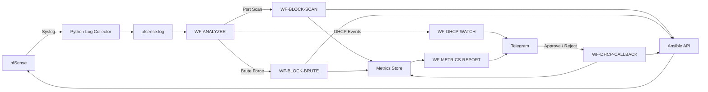

# System Architecture

[← Back to README](../README.md)

## Purpose

This document describes the architecture of the CHA3P07 Network Automation system at a technical level. It focuses on component responsibilities, data movement, workflow boundaries, and the relationship between pfSense, the Python collector, n8n, Ansible, and Telegram.

Environment-specific values such as internal IP addresses, credentials, and local filesystem paths are intentionally excluded from this document.

---

## 1. Architectural Goals

The system is designed around five principles:

1. **Separation of responsibilities** — log collection, analysis, response, approval, and reporting are handled by different components.
2. **Workflow modularity** — each n8n workflow has one primary responsibility.
3. **Human control where required** — security responses can be automated, while new-device access remains subject to administrator approval.
4. **Traceability** — detected events and automation results are recorded for correlation and later review.
5. **Replaceable infrastructure layers** — environment-specific network addresses, credentials, and storage locations are configuration concerns rather than architectural assumptions.

---

## 2. High-Level Architecture



---

## 3. Component Responsibilities

### pfSense

pfSense is the network enforcement and event source layer.

Responsibilities:

- Produce firewall and service logs.
- Produce DHCP events.
- Apply firewall changes requested through the automation layer.
- Apply DHCP/static mapping changes requested through the automation layer.

pfSense does not perform the orchestration implemented by n8n.

### Python Log Collector

`pf_collector.py` is a transport and persistence component.

Responsibilities:

- Listen for pfSense Syslog messages.
- Add a receive timestamp.
- Append messages to the active log file.
- Rotate the active log file when required.

The collector intentionally does **not** classify logs or make security decisions.

```text
Receive → Timestamp → Persist → Rotate
```

### WF-ANALYZER

`WF-ANALYZER` is the central analysis and routing layer.

Responsibilities:

- Read collected pfSense logs.
- Separate DHCP traffic from security-relevant events.
- Parse firewall and authentication signals.
- Group security signals by source.
- Apply detection rules.
- Perform incident-level deduplication.
- Create event metadata.
- Write event/ban queue data.
- Route DHCP content to `WF-DHCP-WATCH`.

The Analyzer is the component that decides whether a security event should enter a response workflow.

### WF-BLOCK-SCAN

Handles port-scan response.

Responsibilities:

- Read detected scan sources.
- Ignore already processed entries.
- Correlate the source with the Analyzer event.
- Request a block action from the Ansible API.
- Record the automation result.
- Send an operator notification.

### WF-BLOCK-BRUTE

Handles brute-force response.

Its responsibilities are equivalent to `WF-BLOCK-SCAN`, but for events classified as brute force.

### WF-DHCP-WATCH

Handles newly observed DHCP devices.

Responsibilities:

- Receive DHCP content from `WF-ANALYZER`.
- Group DHCP messages by MAC address.
- Enrich device information when hostname data is available.
- Compare devices against approved, rejected, and pending state.
- Create a pending device record.
- Send an approval request to Telegram.
- Create an approval event for later correlation.

### WF-DHCP-CALLBACK

Handles the administrator decision.

Responsibilities:

- Read Telegram callback actions.
- Resolve the selected pending device.
- Process approval or rejection.
- Request network configuration through the Ansible API when approved.
- Verify the resulting DHCP state.
- Update device state.
- Record automation metrics.

### Ansible API

The Ansible layer converts an orchestration request into an infrastructure change.

Typical responsibilities:

- Block a source address at the firewall.
- Create or update a DHCP/static mapping.
- Return an execution result to n8n.

The Ansible layer should be designed to be idempotent so repeated requests do not create conflicting state.

### WF-METRICS-REPORT

Reads automation results and produces operator-facing reports.

Responsibilities:

- Read stored metrics.
- Filter by automation scenario.
- Calculate summary statistics.
- Format the report.
- Return the report through Telegram.

---

## 4. Data Flow

### Security Event Flow

```text
pfSense
  ↓
Python Collector
  ↓
pfsense.log
  ↓
WF-ANALYZER
  ↓
Security Classification
  ↓
Event / Ban Queue
  ↓
WF-BLOCK-SCAN or WF-BLOCK-BRUTE
  ↓
Ansible API
  ↓
pfSense
  ↓
Metrics + Notification
```

### DHCP Device Flow

```text
pfSense DHCP Event
  ↓
Python Collector
  ↓
WF-ANALYZER
  ↓
WF-DHCP-WATCH
  ↓
Unknown Device
  ↓
Telegram Approval
  ↓
WF-DHCP-CALLBACK
  ↓
Ansible API
  ↓
pfSense DHCP Configuration
  ↓
DHCP Verification
  ↓
Device State + Metrics
```

---

## 5. Runtime State

The system currently uses file-based runtime state.

The main categories are:

| Category | Purpose |
|---|---|
| Active network log | Input for the Analyzer |
| Ban/event queues | Transfer detected security events to response workflows |
| Device state files | Track approved, pending, and rejected DHCP devices |
| Approval event data | Correlate device approval with later processing |
| Metrics data | Store automation results for reporting |
| Telegram offset state | Avoid reprocessing previously consumed updates |

These files are runtime artifacts and should remain outside source control.

---

## 6. Workflow Boundaries

The intended responsibility boundary is:

```text
Collector
  └─ stores raw input

Analyzer
  └─ interprets input and decides event type

Response Workflows
  └─ execute the selected automation action

Ansible
  └─ changes infrastructure state

Metrics Workflow
  └─ summarizes execution results

Telegram
  └─ operator interaction and notification
```

Keeping these boundaries explicit reduces duplicated logic and makes testing easier.

---

## 7. Failure Boundaries

Failures should be treated according to the layer in which they occur:

- **Collector failure:** new logs are not persisted.
- **Analyzer failure:** logs exist but are not classified or routed.
- **Response workflow failure:** an event is detected but the intended infrastructure action may not complete.
- **Ansible/API failure:** orchestration succeeds up to the execution boundary, but the network state may remain unchanged.
- **Telegram failure:** automated network actions may still work, but approval or reporting interaction may be unavailable.
- **Metrics failure:** operational actions may complete even if performance records are not written.

This separation is useful when troubleshooting because it identifies which layer owns the failed responsibility.

---

## 8. Architecture Summary

The project follows a pipeline-oriented model:

```text
Collect → Analyze → Route → Execute → Verify → Record
```

The security workflows are automation-first, while the DHCP workflow introduces human approval before network access is granted.

For detection details, see [detection-logic.md](detection-logic.md).  
For DHCP processing, see [dhcp-automation.md](dhcp-automation.md).  
For measurement, see [metrics.md](metrics.md).  
For installation, see [deployment.md](deployment.md).  
For operational security guidance, see [security-notes.md](security-notes.md).
