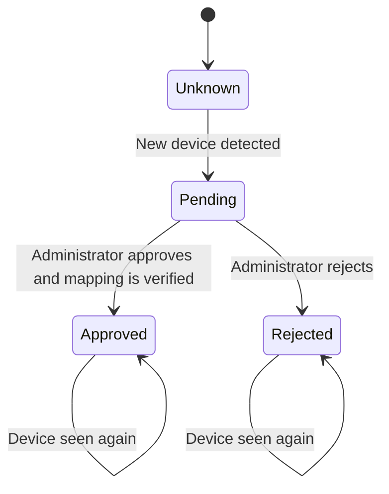

# DHCP Automation

[← Back to README](../README.md)

## Purpose

This document describes the human-in-the-loop DHCP workflow used to identify new devices, request administrator approval, apply network configuration, and verify the result.

Environment-specific address pools, infrastructure addresses, chat identifiers, and credentials are intentionally excluded.

---

## 1. Workflow Scope

DHCP automation is split across three logical components:

```text
WF-ANALYZER
    ↓
WF-DHCP-WATCH
    ↓
Telegram
    ↓
WF-DHCP-CALLBACK
    ↓
Ansible / pfSense
```

The Analyzer routes DHCP content. `WF-DHCP-WATCH` detects unknown devices. `WF-DHCP-CALLBACK` processes the administrator decision.

---

## 2. DHCP Event Intake

The Analyzer identifies DHCP-related log records and forwards them to `WF-DHCP-WATCH`.

Relevant DHCP events include:

```text
DHCPDISCOVER
DHCPREQUEST
DHCPOFFER
DHCPACK
```

Additional DHCP event types may also be present in the routed content.

---

## 3. Device Correlation

A single DHCP exchange can generate several log records for the same device.

`WF-DHCP-WATCH` groups events by MAC address so it can build one device view from multiple DHCP messages.

This is useful because the earliest DHCP message may not contain all available information.

For example:

```text
DHCPDISCOVER
      ↓
MAC known, hostname may be missing
      ↓
DHCPREQUEST / DHCPOFFER / DHCPACK
      ↓
Additional device information may become available
```

The workflow normalizes MAC addresses before comparison.

---

## 4. Device State Model

The system maintains three device states.

### Approved

The device has been accepted and has a stored network mapping.

Conceptual record:

```text
MAC, assigned address, hostname
```

### Pending

The device has been detected but no final administrator decision has been completed.

Conceptual record:

```text
MAC, hostname
```

### Rejected

The administrator has explicitly rejected the device.

These state files prevent the same device from repeatedly creating new approval requests.

---

## 5. Unknown Device Detection

Before generating an approval request, `WF-DHCP-WATCH` builds a set of known MAC addresses from all three state sources:

```text
Approved
Pending
Rejected
```

The workflow only continues when the detected MAC does not already exist in that known set.

```text
Detected MAC
    ↓
Known?
 ┌──┴──┐
Yes   No
 ↓     ↓
Stop  Create Pending Device
```

---

## 6. Pending State

A newly discovered device is written to the pending device list before operator interaction completes.

This provides two benefits:

- Repeated DHCP messages do not generate duplicate Telegram requests.
- The callback workflow has a stable source from which to resolve device metadata later.

---

## 7. Telegram Approval Request

The workflow sends an operator-facing message containing available device identity information such as:

```text
MAC address
Hostname, when available
```

The message exposes two actions:

```text
APPROVE
REJECT
```

The callback data includes the decision and the target MAC address.

No network configuration change is made merely because the device was detected.

---

## 8. Approval Event

When a new device approval request is created, the workflow also writes an approval event.

The event contains information such as:

```text
event_id
scenario
mac
hostname
process_started_at
status
```

This event is later used to correlate the approval workflow with performance measurements.

---

## 9. Callback Processing

`WF-DHCP-CALLBACK` polls Telegram for callback queries.

It ignores ordinary text messages and only processes supported approval actions.

The callback workflow:

1. Parses the requested action.
2. Normalizes and validates the MAC address.
3. Finds the matching device in pending state.
4. Branches into approval or rejection processing.

---

## 10. Approval Path

The approval path performs the following steps:

```text
APPROVE
  ↓
Resolve Pending Device
  ↓
Select Available Address
  ↓
Request Static Mapping
  ↓
Wait for Network State
  ↓
Read DHCP Log
  ↓
Find Matching DHCPACK
  ↓
Record Approved Device
  ↓
Write Metrics
```

### Address Selection

The current implementation chooses an available address from a configured DHCP/static-mapping pool.

The pool belongs to deployment configuration and should not be hard-coded into documentation.

The selection logic avoids addresses already present in the approved-device state.

### Static Mapping Request

The callback workflow sends a request to the Ansible automation layer containing information equivalent to:

```json
{
  "client_mac": "<device MAC>",
  "ip": "<selected address>",
  "hostname": "<device hostname>"
}
```

The Ansible layer applies the required mapping to pfSense.

### DHCP Verification

After the configuration request, the workflow waits and then re-reads DHCP log data.

It searches for a `DHCPACK` corresponding to the approved MAC address.

The device is considered verified only when the expected DHCP result can be found.

This gives the workflow a post-change verification step instead of treating the API request alone as proof of success.

---

## 11. Rejection Path

The rejection path does not create a network mapping.

Instead:

```text
REJECT
  ↓
Record Device as Rejected
  ↓
Prevent Repeated Approval Requests
```

The rejected state can be reviewed or changed manually according to operational policy.

---

## 12. State Transition Model



The current workflow does not automatically move an approved or rejected device back to pending.

---

## 13. Error and Edge Cases

The DHCP workflow should account for:

- Pending device no longer existing when the callback arrives.
- Invalid or malformed MAC addresses.
- No available address in the configured pool.
- Ansible/API failure.
- Mapping applied but DHCP verification not yet visible.
- Telegram callback duplication.
- Missing hostname.
- Concurrent approval of multiple devices.
- Runtime state file unavailable or malformed.

These cases should fail safely without assigning unintended network access.

---

## 14. Operational Principles

The DHCP workflow follows these principles:

- Device detection does not equal device authorization.
- Administrator approval is explicit.
- Pending state suppresses duplicate requests.
- Infrastructure changes are delegated to Ansible.
- DHCP state is verified after the change.
- Device identity is based primarily on MAC address.
- Deployment-specific network values remain configuration.

For architecture, see [architecture.md](architecture.md).  
For metrics, see [metrics.md](metrics.md).  
For security controls, see [security-notes.md](security-notes.md).
